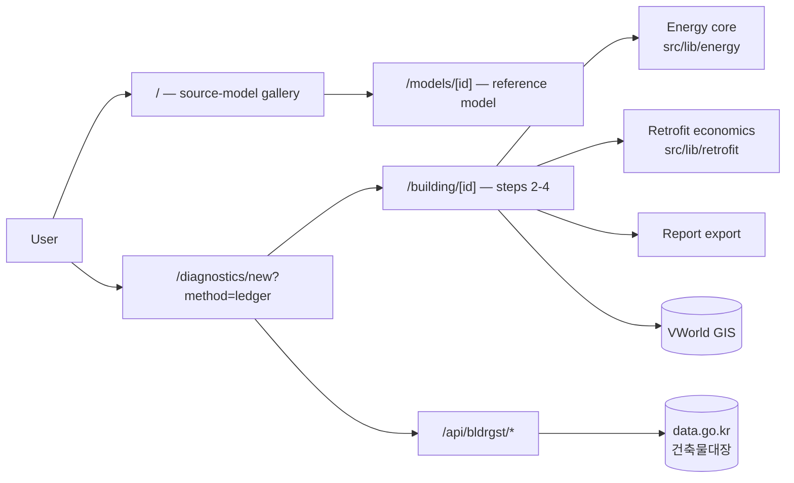

# Project Overview

**BIMFIT** turns a Korean building's public register entry into a working energy
model, then lets the user sharpen that model toward the real building until the
retrofit economics are worth acting on.

The product mission is to help professionals structure a building-improvement
decision from evidence. Models, materials, simulation and reports should clarify
what to improve, why, and which missing information could change the advice.
[[Business and Service Model]] defines the proposed customer and service offer;
pricing and willingness to pay remain hypotheses for paid-pilot validation.

The product's whole credibility rests on one distinction: what the register
actually *states*, versus what has been *assumed* on its behalf. That distinction
is enforced in code, not by convention — see [[ADR-002 - Provenance as a Construction-Time Invariant]].

## The workflow

The product is four fixed steps. This shape is settled; features are added
*inside* it rather than beside it.

```text
1. 건물 검색      건축물대장 (building register) search                          →  /diagnostics/new?method=ledger
2. 도면 업로드    Upload the building's CAD drawings                              →  /building/[id]
3. 디지털 트윈    The 3D twin; typed inputs recompute the energy profile           →  /building/[id]
4. 보고서         Report, exported as PDF / CSV / JSON                            →  /building/[id]
```

Step 1 hands off to steps 2–4, which all live in the twin workspace at
`/building/[id]`. See [[Data Flow]] for what moves between them.

`/` is the source-model gallery, preceding the workflow without a link to step 1
(the deliberate decision in [[ADR-004 - The Landing Page Is a Model Gallery]]).

## What it does

- **Finds a real building.** 시/도 → 시/군/구 → 법정동, or by address, against
  the 건축물대장 open-data service.
- **Builds a baseline with no user input.** The register states floor areas,
  storey counts, height, main use, structure and approval dates — enough for a
  multi-storey energy model. Everything it does *not* state (U-values, window
  ratio, airtightness, HVAC, lighting, occupancy) comes from era-indexed Korean
  code tables and is recorded as a **named, visible, reversible assumption**.
- **Shows the building.** A 3D twin with envelope, structure, MEP, electrical,
  lighting, plumbing, fire, lift and gas layers, plus energy zones.
- **Prices the retrofit.** Physical measures with investment, payback, saving
  and NPV under a DCF model and an optional CAPEX budget. Funding-program
  controls are removed; economics use the unsubsidized baseline. Current energy
  calculations do not yet quantify every measure's benefit.
- **Produces a report.** Energy audit and compliance previews, exportable.

## Who it is for

Practitioners assessing an existing Korean building for energy retrofit —
someone who can name a building by address and needs a defensible number, plus
the investment case that follows from it.

## Major technologies

| Concern | Choice |
|---|---|
| Framework | Next.js 16 (App Router), React 19, TypeScript |
| 3D | React Three Fiber v9 + three.js, InstancedMesh-based procedural geometry |
| State | Zustand (several stores, some persisted), TanStack Query for server data |
| Persistence | IndexedDB via `idb-keyval` — projects, sources, designs |
| Testing | vitest (unit/component), Playwright (e2e) |
| Hosting | Vercel |

> **Next.js caveat.** This version has breaking changes relative to most training
> data. `AGENTS.md` requires reading `node_modules/next/dist/docs/` before writing
> Next-specific code. Treat remembered Next.js APIs as suspect.

## System boundaries



Three external systems matter: the **건축물대장** register (the product's
primary data source), **VWorld** (GIS building outlines), and **Anthropic**
(natural-language generation, a secondary entry path). See [[Integration Map]].

## Where to start reading

1. [[Current State]] — what is genuinely working, partial, or unmounted
2. [[Repository Map]] — which directory owns what
3. [[System Architecture]] — subsystem boundaries and dependency direction
4. [[CURRENT]] — if you are an agent picking up in-flight work

## Related

- [[Product Intent]] — the constraints and non-goals behind these choices
- [[Testing Strategy]] · [[Build and Run]] · [[Deployment and Environment]]
