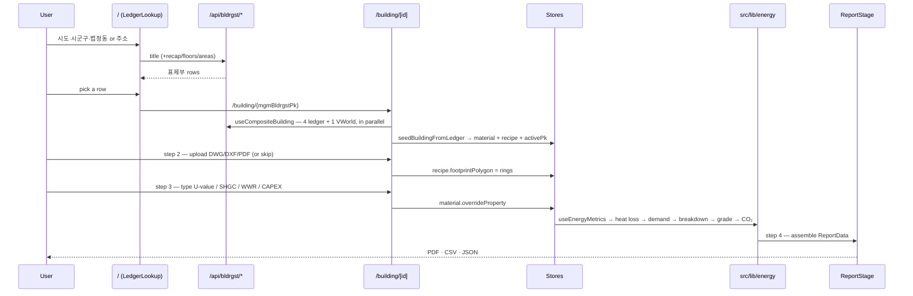
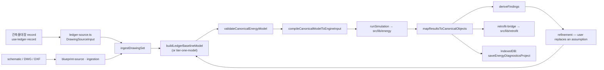

# Data Flow

Two end-to-end flows exist. **Flow A is the product.** Flow B is the
source-traceable engine, which lives in a second workspace and is *not yet* the
source of the twin's numbers.

## Flow A — the four-step workflow (primary)

`건축물대장 검색 → 도면 업로드 → 디지털 트윈 → 보고서`



### Step 1 — 건축물대장 search

`/` renders `LandingPage → CadSheet → LedgerLookup`. The register lookup exists
in exactly one place in the app, and an e2e test asserts that.

- [ledger-lookup.tsx](../../src/components/energy-diagnostics/ledger-lookup.tsx)
  — note this component lives under `energy-diagnostics/`, not `search/`
- `hrefForBuilding` = `` `/building/${encodeURIComponent(buildingId)}` ``;
  [search-results-table.tsx](../../src/components/search/search-results-table.tsx)
  does the `router.push`
- Rows are scored by `scoreDataQuality`, so an incomplete register row is
  visibly flagged rather than silently rendered

### Step 1b — resolving the building record

[use-composite-building.ts](../../src/hooks/use-composite-building.ts) fires
**five** queries in one `useQueries` call — `title`, `recap`, `floors`, `areas`
and, when an address is known, the VWorld footprint — with `retry: 2` and
`retryDelay = min(400 · 2^attempt, 1500)`. The in-file justification: data.go.kr
commonly 502s the first call after an idle period and serves the identical
request fine immediately after.

**No consumer requires all four endpoints.** `use-ledger-record.ts` returns
`phase: "ready"` as soon as `title.items[0]` exists — "a blip on a sibling call
must not discard a title we actually received". See [[Integration Map]].

The record then seeds the twin: `useEnsureBuildingModel → seedBuildingFromLedger`
writes `material-store.setProperties` + `recipe-store.setBaseRecipe`, and
`useActiveBuildingStore.setActiveBuilding(pk, sigunguCd)` publishes the scoping
fact every panel reads.

### Step 2 — 도면 업로드

[upload-stage.tsx](../../src/components/upload/upload-stage.tsx) accepts
`.dxf`, `.dwg`, `.pdf` (SVG enters through the schematic import dialog instead).
DWG runs a header-version check then LibreDWG WASM, falling back to
`POST /api/cad/convert`. PDF opens the tracer. Multiple candidate outlines open
`LayerPicker`.

Three writes leave this stage:

1. `recipe-store.setOverride(pk, "footprintPolygon", rings)` — this is the value
   the `upload` stage guard reads **and** the value `envelopeQuantities`
   switches on (`source: "bbox" → "polygon"`)
2. `twin-provenance-store.patch(pk, { hasCadFootprint, hasCadPlan, cadOrigin })`
3. `workflow-store.advance(...)` or `skipCad(pk)`

### Step 3 — 디지털 트윈 (the typed inputs)

`WorkspaceShell` renders the 3D children for stage `twin`;
[building-scene.tsx](../../src/components/viewer/building-scene.tsx) owns the
canvas and mounts `ConfigPanel`.

```text
config-tabs/envelope-tab.tsx
  벽체 열관류율 · 창호 열관류율 · SHGC · 창면적비(WWR) · 지붕 · 바닥 · ACH50
        │  material-store.overrideProperty(pk, "envelope.walls.0.uValue", …)
        ▼
useEffectiveRecipe  (the single merge — do not re-inline it)
        ▼
useEnergyMetrics
  getClimateData(sigunguCd)
  → envelopeQuantities(recipe)
  → calculateHeatLoss        (ISO 13789-style, per element, own ΔT)
  → calculateAnnualDemand    (degree-day)
  → calculateSystemBreakdown (+ lighting / DHW / plug)
  → deliveredFromDemand      (shared fuel split)
  → calculateEfficiencyRating (official MOTIE/KEMCO primary-energy grade)
  → calculateCO2
```

Every slider feeds `useEnergyMetrics` on the next render. This path is the
**간이 모델** — see the honest limits below.

### Step 3b — retrofit economics

[use-retrofit-scenario.ts](../../src/hooks/use-retrofit-scenario.ts) turns the
same material state plus the CAPEX budget into measures:

```text
material-store + scenario-store(budget, ProgramTrack)
  → generateEnvelopeRetrofits / generateHvacRetrofits /
    generateLightingRetrofits / calculateSolarPotential
  → selectMeasuresForBudget          (knapsack)
  → computeFinancials                (NPV, IRR capped at 5.0,
                                      discounted payback, interest saved)
```

`scenario-store` persists budget, track and `ScenarioBuildingInputs` so the twin
overlay and the scene outliner cannot disagree — its own header says that
disagreement is why it exists. The measure selection also drives which physical
equipment renders in 3D (`layers/equipment-scenario.ts` +
`retrofit/measure-visuals.ts`), so the money and the model agree.

### Step 4 — 보고서

[report-stage.tsx](../../src/components/report/report-stage.tsx) reads
`useEnergyMetrics`, `useEffectiveRecipe`, `useActualEnergy`,
`useRetrofitScenario` and `useEngineResult`, then
`assembleEnergyAuditReport` / `assembleComplianceReport` → `ReportData`.

- **PDF** — `await import("@react-pdf/renderer")` + `await import("@/lib/report/pdf-renderer")`
  on click only. `pdf-renderer.tsx` side-imports `./pdf-fonts` to register
  NotoSansKR before any render; without it Korean glyphs do not appear.
- **CSV** — `generateBuildingCSV`
- **JSON** — `generateTwinJSON`

Coupling worth knowing: `report-engine.ts` types its input as `EnergyMetrics`
imported *from the hook* — a lib module depending on a hook's type. That is how
tightly the report is bound to the simplified path.

### Honest limits of Flow A

- The numbers carry **no provenance**. Nothing distinguishes a register-stated
  floor area from an era-table U-value.
- The envelope is one ring × total height
  ([envelope-quantities.ts](../../src/lib/energy/envelope-quantities.ts)); per-storey
  plans cannot change it.
- The simplified path still uses the unsafe `classifyEra`
  (via `src/lib/material-inference.ts`), which silently returns `1990-1999` for a
  blank date.
- `report-stage.tsx` hardcodes `dataQualityScore: 60` into the export payload
  even though the search table computes a real score.

## Flow B — traceable diagnosis (a second workspace, not the twin's source)

> **This flow does not feed steps 3 or 4.** It is reachable only at
> `/diagnostics/new`. Integrating it into the twin is the top outstanding work
> item. See [[System Architecture]].



Entry: `/diagnostics/new?method=ledger|upload|create|sample|resume`. The route
redirects to `/` when no method is given, and when `method=ledger` arrives
without a `building` — there is one landing page.

### Why the register enters as a drawing source

[ledger-source.ts](../../src/lib/energy-diagnostics/ledger-source.ts) turns a
`BrTitleInfo` + floor rows into a `DrawingSourceInput` — source document #0 of
the same `DrawingSet` that later receives DWG/DXF plans and schematics. Its
header states the reason: routing the register through `ingestDrawingSet` rather
than a private side door is what makes provenance a construction-time invariant.

It also states what the register does **not** contain, and therefore what this
module never emits: "any U-value, window ratio, airtightness, HVAC, lighting or
occupancy value, and any real building outline."

Those missing values come from the era-indexed tables in
[korean-building-codes.ts](../../src/lib/korean-building-codes.ts) and are
emitted as assumptions with named ids (`LEDGER_ENVELOPE`, `SYSTEMS`, `USAGE`,
`BASEMENT`, `ERA_UNKNOWN`, `FOOTPRINT`) — `sourceRefs: []`, `confidence: null`.

### Documented traps, each with a regression test

| Trap | Guard |
|---|---|
| ACH50 is a blower-door figure | `const naturalAch = AIRTIGHTNESS[era] / 20;` — getting it wrong overstates ventilation loss twentyfold while still looking ordinary |
| `classifyEra` returns `1990-1999` for a blank date | the traceable path uses `classifyEraExplicit` ([floor-rows.ts](../../src/lib/ledger/floor-rows.ts)), which reports whether it read a date at all |
| a documented zero | emits **no fact**, not a zero-valued one |
| ingestion once stamped every boundary `dimensioned_vector_geometry` | that would relabel a synthesised rectangle as survey |
| below-grade storeys | recorded, not extruded, with the excluded m² named |

### Refinement

The user replaces an assumed value; `refinement.ts` records it as *the user's
value* (`extractionMethod: "user_input"`), never as a measurement, and never
through `createScenarioDelta`. Every refinement must end with `refreshModel()` —
a model whose `facts` index has drifted from its sub-objects fails preflight in
ways that are hard to trace back.

### Economics from a diagnosis

[retrofit-bridge.ts](../../src/lib/energy-diagnostics/retrofit-bridge.ts) is
pure: it "reads only the exact engine payload of a succeeded baseline run —
never zustand stores". It states its own screening limits in `notes`: closed-form
degree-day savings rather than per-measure engine re-runs, fixed 2024 KRW/kWh
prices, and a 2,500 h/yr lighting default because no canonical schedule exists.

Both flows therefore reach the same `src/lib/retrofit` generators and
`economic-model.ts`, but from different inputs.

### Persistence

`saveEnergyDiagnosticsProject` writes to IndexedDB via `idb-keyval` — see
[[Runtime Architecture]] for the key shapes.

## The VWorld gap

The GIS outline is fetched and used by the twin's scene, but it is **not** wired
into the traceable baseline. [use-ledger-record.ts](../../src/components/energy-diagnostics/use-ledger-record.ts)
says why, in its own doc comment: the polygon is in lon/lat degrees, and reaching
fidelity L1 honestly means projecting it to metres rather than handing degrees to
a builder that expects metres.

The receiving seam already exists — `ledger-source.ts` accepts
`{ kind: "vworld_building"; ringM: Polygon2D }` and stamps
`cadLayer: "VWORLD_LT_C_SPBD"` — and
`rebuildLedgerBaselineWithFootprint(record, footprint, locale)` is exported and
waiting. Until a projection lands, the baseline synthesises a rectangle from
건축면적 under `assumption.ledger-derived-footprint`.

## Related

[[System Architecture]] · [[Integration Map]] · [[Runtime Architecture]] ·
[assumption-catalog.md](../assumption-catalog.md) ·
[energy-input-source-map.md](../energy-input-source-map.md)
