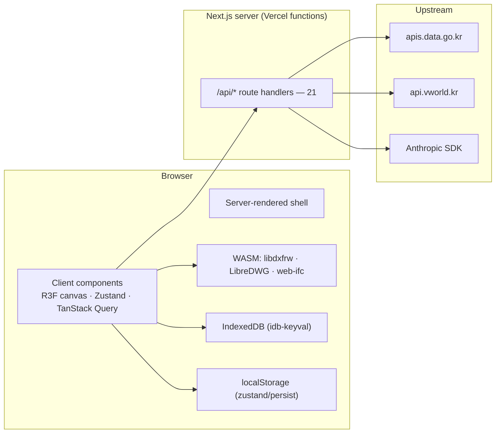

# Runtime Architecture

Where code actually executes, what it stores, and what it deploys onto.

> This Next.js version has breaking changes versus training data. Read the
> relevant guide in `node_modules/next/dist/docs/` before writing Next-specific
> code — that rule comes from [AGENTS.md](../../AGENTS.md) and is not enforceable
> by tooling.

## The split

Almost everything is client-side. The server exists to (a) hold credentials and
(b) do the few things a browser cannot.

## Runs on the server

| Surface | Why it is server-side |
|---|---|
| `/api/bldrgst/*` (6) | holds `DATA_GO_KR_API_KEY`; upstream has no CORS story |
| `/api/energy/{consumption,grade}`, `/api/weather` | same key path, different data.go.kr services |
| `/api/vworld/footprint` | holds `VWORLD_API_KEY` / `VWORLD_DOMAIN` |
| `/api/cad/convert` | tier-2 DWG→DXF when the browser tier fails |
| `/api/generative/*` (6) | holds `ANTHROPIC_API_KEY`; two stream SSE |
| `/api/twin-data/*`, `/api/v1/*` | operator surfaces, filesystem + key-gated |
| `/releases` page | **server component only**, by design — enforced by a CI guard |
| `/building/[id]/page.tsx`, `/diagnostics/new`, `/studio` | thin server wrappers: id validation, metadata, redirects |

Route-handler notes worth carrying:

- Five of the six `bldrgst` routes are one-line instantiations of
  `createDataGoKrProxy(endpoint)`. `numOfRows` clamps to 100 — except `floors`
  and `areas`, capped at **500**, because a tall building registers several use
  rows per storey and a 100-row cap silently truncates its 층별개요.
- `/api/bldrgst/title` is bespoke: it adds `batchMode` over a comma list of
  법정동 codes with `MAX_BATCH_CODES = 10`, `MAX_BATCH_ITEMS = 20`.
- `/api/generative/generate` and `generate-from-blueprint` are
  `dynamic = "force-dynamic"` with `maxDuration` 120 / 300 and stream SSE.
  `generate-from-blueprint` makes **no** model call — a blueprint is already
  semantic — so the drawing path works with no Anthropic key.
- `/api/twin-data/upload` requires `x-twin-data-key` matching
  `TWIN_DATA_API_KEY` and **fails closed with 401 when that variable is unset**;
  64 KiB body cap, slug validation, containment-checked path resolution,
  constant-time compare. Its `GET` sibling is deliberately unauthenticated.
- `/api/v1/eco2-imports` returns 503 in production — it is a local-development
  corpus tool behind `CORPUS_API_KEY`.
- `/api/v1/predictions/[bjdongCd]` has an in-memory 60 req/min per-IP token
  bucket and no in-app caller; it is a published endpoint.

## Runs in the browser

- **The whole twin.** `BuildingScene` is lazily imported by
  `building-workspace.tsx`; `WorkspaceShell` lazily code-splits `ReportStage`,
  `UploadStage`, `ParamsStage`.
- **All physics.** `src/lib/energy` and `src/lib/energy-diagnostics` run client-side.
  No energy number is computed on a server.
- **All CAD parsing**, including the WASM tiers below.
- **PDF generation** — `@react-pdf/renderer` is dynamically imported on click.

### WASM in `public/wasm/`

| Binary | Used for | Loaded |
|---|---|---|
| `libdxfrw.js` / `.wasm` (~1.4 MB) | DWG→DXF tier 1 | eagerly on the CAD path |
| `libredwg-web.wasm` (~10 MB) | DWG→DXF tier 2, reads AC1032 / 2018+ | lazily |
| `web-ifc.wasm`, `web-ifc-mt.wasm` | real IFC4 export | only on an explicit export click |

All three DWG tiers funnel through `parseDxfText` so ranking and unit handling
are identical regardless of which tier produced the DXF.

The IFC boundary is deliberate:
[use-engine-result.ts](../../src/hooks/use-engine-result.ts) computes the
continuously-updating result with a pure **counting** write session (no WASM, no
I/O) so fidelity numbers stay current, and touches the real
`getSharedIfcWriteSession()` only from `exportIfc()`.

## Persistence

### localStorage — `zustand/persist`

14 stores under fixed keys (`korea-building-info-storage`,
`bim-material-properties`, `bim-recipe-overrides`, `bim-layer-store`,
`bim-workflow-state`, `bim-workspace-layout`, `bim-scenario-state`,
`bim-twin-provenance`, `bim-model-authored`, `bim-document-ui`,
`bim-annotation-store`, `editor-mode-store`, `bim-equipment-params`, plus
`bim-view-store` / `bim-sheet-store` from `src/lib/bim`).

`persist-migrate.ts::versionedMigrate` is the shared v0→v1 adopter. Fitness
function AFF-3 requires every persisted store to declare `version` + `migrate`.

Rehydration happens **after** first paint, so any component reading a persisted
store during render must gate on `useHydration()` — otherwise SSR and the first
client render disagree. This is the documented Known Issue #1.

### IndexedDB — `idb-keyval`

Four independent namespaces:

| Key shape | Holds |
|---|---|
| `bimfit:energy-diagnostics:project:v{1\|2}:{projectId}` | `StoredEnergyDiagnosticsProject` — kind, storageVersion 2, projectId, modelId, savedAtIso, sourceContentHashes[], model |
| `bimfit:energy-diagnostics:source:v1:sha256:{hash}` | content-addressed original drawing bytes |
| `gen-design:{id}` | only the `BuildingSpec` + identity — `buildDesign` is pure given (spec, buildingPk, generationId, locks) |
| `bim-model-{buildingPk}` | an uploaded IFC/glTF/GLB `ArrayBuffer` + metadata |
| `cad-markups:{docId}` | 2D markups; `cad-draft-store` keeps `CadDocument` drafts |

The v1 diagnostics project envelope is retained as an explicit read contract.
Error codes include `SOURCE_HASH_MISMATCH`, `CORRUPT_SOURCE`,
`UNSUPPORTED_VERSION`, `MIGRATION_FAILED`. The CAD stores take an injectable
storage interface so tests run without IndexedDB.

### Not persisted anywhere

No database, no session store, no server-side user state. A building's twin is
reproduced from the register plus whatever the browser kept.

## Static assets

`public/models/authoring/` (~100 GLB + `catalog.json`, surfaced at `/dev/symbols`),
`public/models/equipment/` (71 GLB: chiller, cooling-tower, boiler,
boiler-condensing, VRF, AHU, elevator, panels, PV, battery…),
`public/bim-assets/`, `public/textures/` (7 PBR sets, applied to the **ground
plane** — the building facade uses recipe-driven materials, not these maps),
`public/hdr/studio.hdr` (reflections only), `public/samples/`,
`public/releases/`.

[equipment-assets.ts](../../src/lib/equipment-assets.ts) preloads once and then
serves synchronously, because layer generators run synchronously. It hands out
**deep clones** (geometry + materials) since generators dispose both on every
regeneration. A load failure degrades to coarse procedural geometry.

## Deployment

Production is **Vercel**, project `bim` (org `matts-projects-d0677dc4`), at
<https://bim-self.vercel.app>. Deploy with `vercel --prod --yes`. There is no
`vercel.json` — all build behaviour comes from `next.config.ts`.

Two traps that have each cost a deploy:

1. A deploy returns state **BLOCKED** — not a build failure — when the HEAD
   commit author email is not an address on the Vercel account. It must be the
   account owner's address.
2. `.vercelignore` must exclude `qa-evidence/`, `test-results/`,
   `playwright-report/` and root `*.png`, or the CLI upload aborts. `qa-evidence`
   alone is 81 MB; the fix took the upload from 45 MB to 672 KB.

`next.config.ts` carries three settings, each preventing a specific failure:

| Setting | Prevents |
|---|---|
| `allowedDevOrigins: ["localhost", "127.0.0.1"]` | the e2e runner drives `127.0.0.1` while developers use `localhost`; without both, pages on the other host never hydrate and the Playwright suite fails silently |
| `serverExternalPackages: ["@mlightcad/libredwg-web"]` | the emscripten glue finds its `.wasm` via `import.meta.url`; bundling rewrites that and the binary is sought in the wrong place |
| `outputFileTracingIncludes` for `/api/cad/convert` | the wasm is loaded by path, so file tracing has nothing to follow and would omit it from the serverless function — working locally, failing on Vercel |

Two alternative targets exist in the repo and are **unexercised**: Cloudflare
Workers via OpenNext (`open-next.config.ts`, `wrangler.jsonc`, worker name
`greenretrofit-bim` — a pre-rename identity) and an OpenAI "Sites" bundle
(`pnpm build:sites` → `.openai/hosting.json`). Neither appears in CI or in any
release procedure. Historical rationale for retaining them is not established.

## Environment variables

Names and purpose only — never values.

| Name | Purpose |
|---|---|
| `DATA_GO_KR_API_KEY` | shared server key for 건축물대장 / energy / weather lookups |
| `VWORLD_API_KEY`, `VWORLD_DOMAIN` | GIS building outlines (`VWORLD_DOMAIN` defaults to `"localhost"` in code) |
| `ANTHROPIC_API_KEY`, `CLAUDE_MODEL` | natural-language generation routes |
| `BIM_REASONING_PROVIDER` | forces `claude` \| `heuristic` |
| `DWG_CONVERTER_PATH`, `DWG_CONVERTER_MODE` | operator-configured external DWG converter (tier before WASM) |
| `TWIN_DATA_API_KEY` | gates `/api/twin-data/upload` — unset means 401, not open |
| `CORPUS_API_KEY` | gates the dev-only `/api/v1/eco2-imports` |
| `E2E_BASE_URL`, `E2E_PORT`, `CI`, `RUN_LIVE_API`, `BIMFIT_E2E_DWG_FIXTURE` | test-runner configuration |

`DATA_GO_KR_API_KEY`, the VWorld pair and `ANTHROPIC_API_KEY` are set in Vercel
production; real register search works there. A local checkout without
`DATA_GO_KR_API_KEY` gets a 401 from the proxy — that is a local condition, not a
product defect.

## Runtime degradation

The app is built so a missing dependency degrades rather than breaks:

- no API key → `/building/demo` still enters the full four-step workflow from
  bundled fixtures (`src/lib/demo/*` intercepts all six `bldrgst` calls and the
  VWorld footprint before any fetch)
- no `ANTHROPIC_API_KEY` → `HeuristicReasoningProvider` takes over, "so a missing
  key degrades to a working building rather than a dead button"
- equipment GLB fails to load → coarse procedural geometry
- no footprint → `buildEngineInput` returns `null` and the UI states the engine
  is unavailable rather than fabricating an outline (fitness function AFF-6)

## Related

[[System Architecture]] · [[Integration Map]] · [[Data Flow]]
