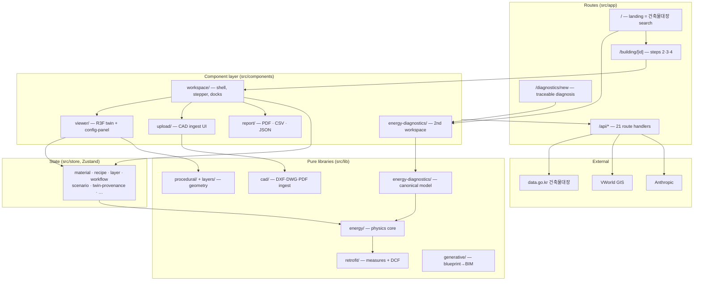

# System Architecture

BIMFIT is a single Next.js 16 App Router application. There is no separate
backend: the only server-side code is the route handlers under `src/app/api/`,
which exist to hold credentials and to run things a browser cannot.

The product is four fixed steps — see [[ADR-001 - Register-First Product Direction]]:

```text
건물 검색  →  도면 업로드  →  디지털 트윈  →  보고서
   /            step 2         step 3        step 4
                └────────── /building/[id] ──────────┘
```

Everything below is organised around one question: **where does a change go?**

## Subsystem map



## Ownership boundaries

| Layer | Owns | Must not |
|---|---|---|
| `src/app/api/*` | credentials, upstream calls, input validation | contain product logic |
| `src/components/*` | rendering, user intent, store writes | contain physics or money math |
| `src/hooks/*` | derivation over stores + TanStack Query | own persisted state |
| `src/store/*` | all mutable app state | import components |
| `src/lib/*` | pure computation | import React or `"use client"` (fitness function AFF-1) |

The intended direction is `components → hooks → store → lib`, and it largely
holds. There are exactly **eight** non-test imports of `@/store` from `src/lib`,
all deliberate: [api-client.ts](../../src/lib/api-client.ts) and `i18n.ts` read
`app-store`; `bim/revit-identity.ts` reads selection; and
`generative/energy/publish-design.ts` + `generative/workspace-handoff.ts` write
into the twin's stores — those two are the generative→twin handoff seam.

## The two energy paths

This is the single most important thing to know before changing an energy number.

| | Twin path (steps 3–4) | Canonical path |
|---|---|---|
| Entry | `/building/[id]` | `/diagnostics/new?method=…` |
| Hook / seam | [use-energy-metrics.ts](../../src/hooks/use-energy-metrics.ts) | [model-operations.ts](../../src/components/energy-diagnostics/model-operations.ts) |
| Inputs | `material-store` + `recipe-store` | `CanonicalEnergyModel` facts |
| Provenance | none — the UI labels it **간이 모델** | construction-time invariant |
| Physics | `src/lib/energy/*` | same `src/lib/energy/*`, via [adapter.ts](../../src/lib/energy-diagnostics/adapter.ts) |

Both end in the same physics core. Only the *inputs* and the *provenance
guarantee* differ. The `간이 모델` badge is real UI text at
[status-bar.tsx:154](../../src/components/workspace/status-bar.tsx).

The separation is enforced by the import graph: `@/lib/energy-diagnostics/*` is
imported by `src/components/energy-diagnostics/*` (16 files) and by
`src/components/landing/resume-diagnostic.tsx` — and by nothing in `viewer/`,
`workspace/`, `report/` or `src/hooks/`. **Wiring the canonical engine into
step 3 is the top outstanding architectural work item.** See [[Data Flow]].

## Physics core — `src/lib/energy`

20 pure modules. ISO-13789-style heat loss per element, degree-day annual demand
(HDD base 18 / CDD base 24), system breakdown, and one shared
`deliveredFromDemand` fuel split used by both the grade and the report.
[energy-grade.ts](../../src/lib/energy/energy-grade.ts) is marked an internal
colour scale — the official rating is
[compliance/efficiency-rating.ts](../../src/lib/compliance/efficiency-rating.ts).

Known simplification, verified in
[envelope-quantities.ts](../../src/lib/energy/envelope-quantities.ts):
`grossWallAreaSqm = wallLengthM × totalHeight` and
`volumeM3 = planAreaSqm × totalHeight`. The envelope is derived from **one ring
× total height**, never summed per storey. Per-storey plans therefore cannot
move the number until this function changes. Below-grade storeys are recorded
but not extruded — there is no ISO 13370 ground path in `src/lib/energy`.

## Canonical model — `src/lib/energy-diagnostics`

26 modules, ~13k lines. See [[Data Flow]] for the pipeline and
[design-stage-energy-diagnostics.md](../design-stage-energy-diagnostics.md) for
the subsystem spec.

Provenance is enforced at construction, not at display:
[facts.ts](../../src/lib/energy-diagnostics/facts.ts) throws
`Fact ${key} needs source evidence, user input, or an assumption.` unless a
non-missing fact carries `sourceRefs`, an `assumptionId`, or
`extractionMethod === "user_input"`. See
[[ADR-002 - Provenance as a Construction-Time Invariant]] and
[assumption-catalog.md](../assumption-catalog.md).

`ledger-baseline-model.ts` is a deliberate **sibling** of `tier-one-model.ts`,
never an extension — sharing a `modelVersion` prefix would trip the Tier-1
acceptance gate in `validation.ts`.

## Geometry and rendering

- [procedural/](../../src/lib/procedural/) — `ProceduralBuilding`, a pure
  Three.js class. Its own comment states the budget: facade 4 + slabs 1 +
  columns 1 + roof 1 = **7 draw calls on the rectangular InstancedMesh path**.
  A polygon footprint falls back to per-face Groups and emits more.
- [layers/](../../src/lib/layers/) — 15 numbered generators grouped under just
  **five** user-visible `LayerId`s: `envelope`, `structure`, `mep`,
  `energy-zones`, `retrofit-targets`.
- [viewer/building-scene.tsx](../../src/components/viewer/building-scene.tsx) —
  the R3F `<Canvas>` owner and the largest coupling point in the render path
  (7 stores + `view-store` + 12 sibling layers).

## State ownership

24 stores in `src/store/` plus two outside it
([bim/views/view-store.ts](../../src/lib/bim/views/view-store.ts),
[bim/sheets/sheet-store.ts](../../src/lib/bim/sheets/sheet-store.ts)).

Persisted to `localStorage` under fixed keys:

| Store | Key |
|---|---|
| app | `korea-building-info-storage` |
| material | `bim-material-properties` |
| recipe | `bim-recipe-overrides` |
| layer | `bim-layer-store` |
| workflow | `bim-workflow-state` |
| workspace | `bim-workspace-layout` |
| scenario | `bim-scenario-state` |
| twin-provenance | `bim-twin-provenance` |
| bim-model | `bim-model-authored` |
| bim-document · annotation · editor-mode · equipment · view · sheet | `bim-document-ui`, `bim-annotation-store`, `editor-mode-store`, `bim-equipment-params`, `bim-view-store`, `bim-sheet-store` |

Deliberately **not** persisted (each carries an in-file reason):
active-building, blueprint, generative-session, outline, selection,
review-highlight, revit-workflow, cad-viewer.

Because persist rehydrates after first paint, anything reading a persisted store
during render must gate on
[use-hydration.ts](../../src/hooks/use-hydration.ts) — `WorkspaceShell` renders a
skeleton until it is true.

## Workflow state machine

[workflow/stages.ts](../../src/lib/workflow/stages.ts) is pure and store-free:

- `WorkflowStage = search | upload | params | twin | report`
- `STAGE_ORDER` (ledger) = `search, upload, twin, report`
- `params` appears **only** in `CAD_FIRST_STAGE_ORDER`
- Only `upload` actually gates: it needs `rings[0].length >= 3`, or an explicit
  `cadSkipped` (which is disabled in cad-first mode)
- `getBlockingStage` walks every intervening guard so a stepper jump reports the
  first real blocker; backward moves are always free

Reachability caveat: `/building/[id]` routes only `demo`, `drawing`, `GEN-*` and
5-part ledger ids (`src/app/building/[id]/page.tsx` — `isRoutableBuildingId`), and
`building-workspace.tsx` states "the cad-draft branch was retired with the
drafting surface". **cad-first mode and the `params` stage are therefore not
reachable in the shipped product**, though the machinery compiles and is tested.

## Retained but unreachable at runtime

Real code, real tests, no mount point. Do not describe these as features:

- `components/generative/generative-studio.tsx` — `/studio` is now pure
  redirects, so the prompt panel and command bar have no host. Only
  `schematic/schematic-editor.tsx` is reused (by the diagnostics product).
- `components/lean/*` and `components/workspace/authoring-palette.tsx` — zero
  importers. `AuthoringPalette` having no importer is what strands the whole 3D
  authoring command set in `lib/bim/model/commands.ts`.
- **Deleted 2026-09-04** (43 zero-importer modules, ~6k LOC, in the hygiene
  sweep): `components/campus/{portfolio-dashboard,comparison-view}`,
  `components/workspace/cad-workspace`, `src/lib/annotations/*` (the directory is
  gone), `src/lib/energy-api-client.ts`, `lib/layers/layer-{1-shell,2-envelope}`,
  and the pre-procedural viewer stack (`building-model` + its slab/column/roof/
  facade generators). Recoverable from git history at `ad6a068`.
- `src/lib/plan-symbols/*` — reachable only from `/dev/symbols`.
- Five LLM routes (`generate`, `modify`, `interpret`, `repair`, `evaluate`) have
  no mounted caller; only `generate-from-blueprint` does, and that route makes
  **no** model call.

## Related

[[Data Flow]] · [[Runtime Architecture]] · [[Integration Map]] ·
[[ADR-000 - Architecture Decision Record Guide]] · [[Repository Map]]
