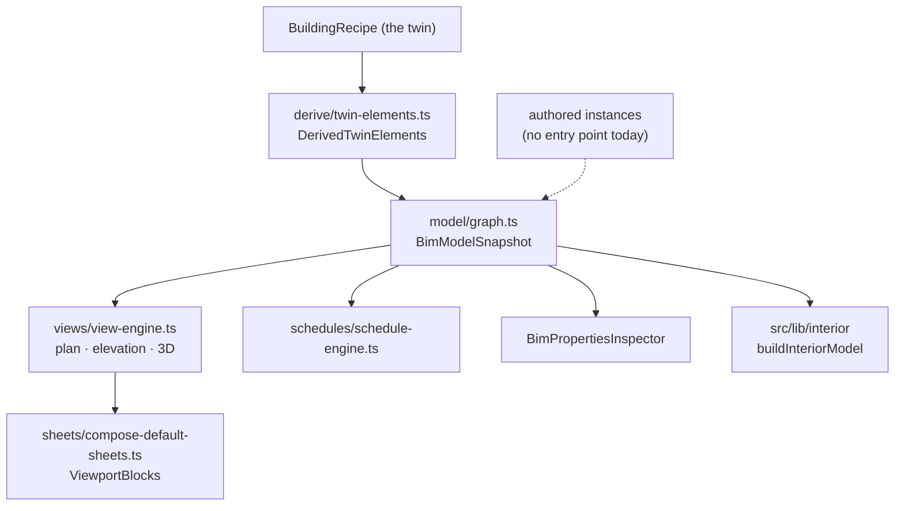

# BIM Document Model (Revit-aligned work rail)

## Purpose

Give the twin a real **element graph** — levels, categories, marks, parameters,
quantities — so schedules, plan/elevation/section views and titled sheets are
live windows on one model rather than screenshots.

## User / System Outcome

The user switches the right-hand work rail between 뷰 / 주석 / 일람표 / 시트 /
에너지. Clicking geometry in 3D selects a real element whose parameters the
inspector reads. Schedules recompute from the model. Sheets compose viewports of
those views.

## Current Status

**partial.** Read and report are wired; **authoring is not reachable.**

**Wired:**
- `RevitWorkRail` mounts for stages `twin` and `report`, exposing five modes.
- `setWorkMode` opens the Schedules and Sheets floating panels for the matching
  modes ([revit-workflow-store.ts:58-59](../../src/store/revit-workflow-store.ts)).
- `BimViewBar` (inside `ContextualToolbar`) toggles the bottom `BimSchedulePanel`.
- `useBimModel` hydrates a snapshot in `WorkspaceShell`, and scene selection is
  mirrored into `useBimModelStore`, so a click selects a real element.
- 28 test files under `src/lib/bim`.

**Not reachable — verified:**
- **3D authoring.** `AuthoringFamilyLayer` returns `null` unless
  `workMode === "authoring"`; `"authoring"` is not one of the five
  `REVIT_RAIL_MODES`; and the only component that can set it —
  `authoring-palette.tsx` — has **zero importers outside its own test**. So
  `applyPlace`, `applyWall`, `applyFloorSketch` and `applyHost` have no runtime
  entry point. (Separately, `BuildingScene` also suppresses the layer entirely
  when `diagnosticsMode` is on.)
- **주석 mode.** It changes the left dock tab and hides the energy HUD, but **no
  component branches on `workMode === "annotate"`**, and the four modules in
  `src/lib/annotations/` (area-label, dimension-line, level-marker, section-cut)
  — **deleted 2026-09-04**; the directory had zero importers. See `ad6a068`
  have zero importers. `useAnnotationStore` is referenced only by its own test.

## Workflow

Overlays steps 3 and 4. `RevitWorkRail` only mounts on `twin | report`, and the
에너지 mode is what reveals the [[Retrofit Economics]] HUD.

## Architecture

`src/lib/bim/` is 43 files (~6 000 lines): `model/` (13), `schedules/` (6),
`sheets/` (5), `views/` (4), plus `phases/`, `derive/`, `annotations/`,
`family-catalog.ts`, `element-id.ts`, `element-registry.ts`,
`ifc-classification.ts`, `iso19650-status.ts`, `revit-identity.ts`.

The command set in `model/commands.ts`: `createWall`, `createFloorSketch`,
`placeInstance`, `hostOnNearestWall`, `flipHosted`, `changeElementType`,
`duplicateType`, `setInstanceParameter`/`setTypeParameter`,
`setLevelName`/`Elevation`, `hideInView`, `undo`/`redo`, `beginCommit`. All
implemented and tested; none reachable from the UI.

## State Ownership

- `useBimModelStore` (persist `bim-model-authored`) — persists **only** authored
  instances, type overrides and the transaction log. Generated elements are
  always re-hydrated from the twin, never persisted.
- `useViewStore` (persist `bim-view-store`) and `useSheetStore` (persist
  `bim-sheet-store`) — the only `create<...>()` calls outside `src/store/`.
- `useRevitWorkflowStore` — **session-only**: `workMode`, `leftDockTab`,
  `schedulePanelOpen`, `sheetPanelOpen`, `activeScheduleId`, `selectedFamilyId`,
  `activeAuthoringTool`, `sketchStart`.
- `useBimDocumentStore` (persist `bim-document-ui`), `useEditorModeStore`
  (persist `editor-mode-store`, including an LRU per-object mode memory).
- `useAnnotationStore` (persist `bim-annotation-store`) — orphaned.

## Implementation

- [model/graph.ts](../../src/lib/bim/model/graph.ts) · [model/commands.ts](../../src/lib/bim/model/commands.ts) · [model/transactions.ts](../../src/lib/bim/model/transactions.ts)
- [views/view-engine.ts](../../src/lib/bim/views/view-engine.ts) · [schedules/schedule-engine.ts](../../src/lib/bim/schedules/schedule-engine.ts) · [sheets/compose-default-sheets.ts](../../src/lib/bim/sheets/compose-default-sheets.ts)
- [revit-work-rail.tsx](../../src/components/workspace/revit-work-rail.tsx) — the five modes
- [revit-workflow-store.ts](../../src/store/revit-workflow-store.ts) — mode → panel wiring
- [derive/twin-elements.ts](../../src/lib/bim/derive/twin-elements.ts) — recipe → elements
- [authoring-asset-manifest.ts](../../src/lib/bim/authoring-asset-manifest.ts) — `publishAuthoringAssets()` runs at module scope in `providers.tsx`

## Relevant Tests

- `src/lib/bim/__tests__/` — `element-id`, `element-registry`, `family-catalog`, `family-insert`, `authoring-placements`, `ifc-classification`, `iso19650-status`, `revit-identity`, `asset-slots`
- `src/lib/bim/model/__tests__/`, `views/__tests__/`, `schedules/__tests__/`, `sheets/__tests__/`
- [revit-workflow.test.ts](../../src/lib/workflow/__tests__/revit-workflow.test.ts)
- `src/lib/interior/__tests__/` — the consumer that turns a snapshot into drawable geometry

## Failure Modes

- Every element must be drawn, listed in `stats.skipped` with a reason, or listed
  in `stats.outOfScope` — `buildInteriorModel` keeps a census so nothing vanishes
  silently.
- Generated-IFC expressIds have no per-mesh correspondence, so HITL review
  highlighting pulses a mesh **category** (window → glass, wall → façade
  panels/mullions, slab → slabs). A door has no distinct mesh and cannot pulse.
- `snapshot-read.ts` is the only mm → m conversion point; a second one would
  silently scale the whole model.

## Known Limitations

- Authoring and annotation are dead code paths with live tests. Whether they are
  parked for revival or abandoned is not recoverable from code — **historical
  rationale not established.**
- The ~102-family authoring GLB catalog (`public/models/authoring/`) is real and
  indexed, but its only runtime surface is the `/dev/symbols` harness.
- The 2D plan-symbol library (`src/lib/plan-symbols/`, 15 test files) is mounted
  only by `PlanOverlay`, whose sole importer is the unmounted generative studio —
  so its only runtime surface is `/dev/symbols` too.

## Related Systems

[[Digital Twin Viewer]] · [[Twin Fidelity and IFC Engine]] · [[Report and Export]] · [[Retrofit Economics]]
