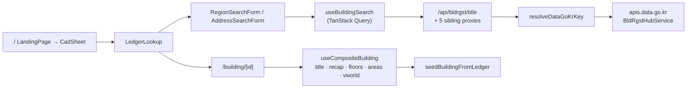

# Building Register Search (건축물대장 조회)

## Purpose

Find a real Korean building in the national building register (건축물대장) and
turn it into a working digital twin — without the user supplying any data,
drawing, or API key of their own.

## User / System Outcome

A user picks 시도 → 시군구 → 법정동 (or types an address), sees a table of
registered buildings scored for data quality, and clicks one. The app navigates
to `/building/<mgmBldrgstPk>` and seeds a twin from the 표제부, 층별개요 and
면적 rows: storeys, heights, gross area, structure code, use code, approval date.

## Current Status

**implemented.** Verified live in production against 대청아파트306동
(`11680-10300-0-0012-0000`). The shared server key is set in Vercel, so search
works for a visitor with no key of their own.

Evidence: [ledger-lookup.tsx](../../src/components/energy-diagnostics/ledger-lookup.tsx)
is mounted directly on `/` inside [cad-sheet.tsx](../../src/components/landing/cad-sheet.tsx);
[e2e/ledger-baseline.spec.ts](../../e2e/ledger-baseline.spec.ts) asserts both that
the register lookup **is** the landing page and that it exists in exactly one place.

## Workflow

This **is** step 1 — 건물 검색. `hrefForBuilding` builds `/building/${id}`, and
`SearchResultsTable` pushes it, entering the stage machine at `search`.

## Architecture

Six server proxies live under `src/app/api/bldrgst/`. Five are one-line
instantiations of `createDataGoKrProxy(endpointKey)`; `title` is bespoke because
it adds a batch mode over a comma list of 법정동 codes (`MAX_BATCH_CODES = 10`,
`MAX_BATCH_ITEMS = 20`) — previously an unbounded sequential loop of 15 s calls.
`floors` and `areas` clamp `numOfRows` to 500 rather than 100, because a tall
building registers several use rows per storey and a 100-row cap silently
truncates its 층별개요.

Key resolution order in [api-shared-key.ts](../../src/lib/api-shared-key.ts):
the caller's own `x-api-key` header always wins and is never rate-limited; else
the shared `DATA_GO_KR_API_KEY`, but **only** for same-origin requests and only
after a per-IP token passes a fixed 60 s / 30-request window. A request with
neither `Origin` nor `Referer` (curl) is not same-origin.

## State Ownership

- `useActiveBuildingStore` — active pk + sigunguCd, published once by
  `LedgerWorkspace` so every panel scopes to one building. Session-only.
- `useAppStore` (persist `korea-building-info-storage`) — the user's own API key,
  language, `lastSearchParams`.
- TanStack Query cache — the register responses themselves.
- `useMaterialStore` / `useRecipeStore` — written by `seedBuildingFromLedger`.

## Implementation

- [ledger-lookup.tsx](../../src/components/energy-diagnostics/ledger-lookup.tsx) — the search UI (note: it lives in the `energy-diagnostics` folder, not `search/`)
- [use-composite-building.ts](../../src/hooks/use-composite-building.ts) — the five-query fan-out
- [_factory.ts](../../src/app/api/bldrgst/_factory.ts) — the shared proxy
- [api-shared-key.ts](../../src/lib/api-shared-key.ts) — key resolution + rate limit
- [korean-building-codes.ts](../../src/lib/korean-building-codes.ts) — era-indexed defaults for everything the register does *not* state
- [constants.ts](../../src/lib/constants.ts) — `parseBuildingId`, `DEMO_BUILDING_ID`

## Relevant Tests

- [e2e/ledger-baseline.spec.ts](../../e2e/ledger-baseline.spec.ts)
- [e2e/first-door.spec.ts](../../e2e/first-door.spec.ts)
- [e2e/building-flow.spec.ts](../../e2e/building-flow.spec.ts) — mocked ledger asserting a specific field (`이투이테스트빌딩`), plus the malformed-id 404 boundary
- `src/app/api/bldrgst/__tests__/`, `src/app/api/bldrgst/title/__tests__/`

## Failure Modes

- **The four endpoints fail independently and intermittently.** The same call
  502s and then returns data. `useCompositeBuilding` retries twice with
  `min(400 · 2^attempt, 1500)` backoff, and consumers never require all four —
  `use-ledger-record.ts` reports `ready` as soon as `title.items[0]` exists,
  because a blip on a sibling call must not discard a 표제부 that arrived.
- No key and no shared key → 401 `Missing x-api-key header`.
- Shared key, but not same-origin, or over 30 req/60 s from one IP → 429 telling
  the caller to supply their own key.
- Client-side, `apiFetch` short-circuits before any fetch when no key is set —
  which is why e2e seeds a dummy key before `page.route` can intercept.

## Known Limitations

- `bjdongCd` is **required**; omitting it returns an empty body, not an error.
- The `mainPurpsCd` filter parameter is ignored upstream — filtering happens
  client-side after fetch.
- Zero values (`platArea=0`, `heit=0`, `bcRat=0`) mean *unavailable*, not zero,
  and render as `-`.
- 전라북도 uses the new 52xxx codes, not the old 45xxx.
- The rate limiter is in-memory and per-instance: a best-effort deterrent on
  serverless, not a hard global cap. A durable limit needs a shared store.
- `parseBuildingId` requires exactly five hyphen-separated parts, so anything
  else 404s at the server via `isRoutableBuildingId`.
- **The register states no physics.** No U-value, window ratio, airtightness,
  HVAC, lighting or occupancy figure, and no real building outline. Those come
  from era-indexed tables and are marked as assumptions — see
  [[Traceable Energy Diagnostics]].

## Related Systems

[[Digital Twin Viewer]] · [[Traceable Energy Diagnostics]] · [[CAD Drawing Ingest]] · [[Repository Map]]
