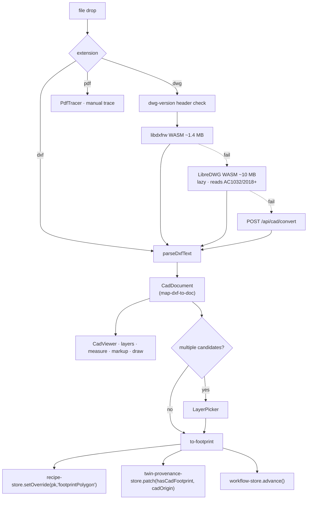

# CAD Drawing Ingest (도면 업로드)

## Purpose

Get a **real surveyed outer boundary** into the twin. The building register
states areas and storey counts but no footprint, so without a drawing the twin
is extruding a rectangle synthesised from 건축면적.

## User / System Outcome

The user drops a `.dxf`, `.dwg` or `.pdf`. The app parses it, shows the candidate
outlines in a 2D viewer they can pan, measure and mark up, and lets them confirm
one as the building footprint. That polygon then drives the 3D massing, the
envelope quantities, and the fidelity badge. A user with no drawing can
explicitly continue without one.

## Current Status

**implemented** and on the main product path.
[upload-stage.tsx](../../src/components/upload/upload-stage.tsx) is lazily
mounted by `WorkspaceShell` whenever `stage === "upload"`, and is the **only**
importer of the full [CadViewer](../../src/components/cad-viewer/cad-viewer.tsx).

Note: `ACCEPTED_EXTENSIONS` is `.dxf`, `.dwg`, `.pdf`. **SVG is not accepted
here** — SVG arrives through the schematic import dialog instead, see
[[Generative Schematic Engine]].

## Workflow

Step 2 — 도면 업로드. It is the only stage that actually gates:
`STAGE_GUARDS.upload` requires an outer ring of ≥ 3 points, **or** the user
explicitly choosing 「continue without CAD」 (`cadSkipped`), in which case the
twin falls back to the ledger/VWorld footprint. The lock reason text names the
real condition rather than a generic "complete this step".

## Architecture

All three DWG tiers funnel through `parseDxfText`, so ranking and unit handling
are identical no matter which tier succeeded. `/api/cad/convert` itself has two
tiers: an operator-configured binary at `DWG_CONVERTER_PATH`, then LibreDWG WASM
in-process — the tier that works on Vercel. Its failure response reports the
detected DWG version and what each tier did rather than a bare 500.

**Two coordinate conventions**, documented in
[src/lib/cad/README.md](../../src/lib/cad/README.md): the footprint path
re-centres to world XZ at the origin, while everything under `src/lib/cad/doc/`
stays in metres, native DXF XY, radians CCW, and is re-centred only by
`doc/to-footprint.ts`.

`dxf-parser.ts` handles `LWPOLYLINE`/`POLYLINE` (closed flag, or visually closed
within 1 % of the bbox diagonal), `CIRCLE`, stitched `LINE` loops
(`line-stitcher.ts`, 0.1 % tolerance, 20 000-segment cap) and `INSERT` blocks to
depth 3, converting units via `$INSUNITS`.

## State Ownership

- `useRecipeStore` (persist `bim-recipe-overrides`) — `footprintPolygon` override. This is exactly what the upload guard reads and what `envelopeQuantities` switches on.
- `useTwinProvenanceStore` (persist `bim-twin-provenance`) — `hasCadFootprint`, `hasCadPlan`, `cadOrigin` (bbox centre in native metres, used to pin cores later).
- `useWorkflowStore` (persist `bim-workflow-state`) — stage + `cadSkipped` (deliberately excluded from `partialize`).
- `useCadViewerStore` — session-only viewer open state.
- `useCadDraftStore`, `useCadMarkupStore` — IndexedDB via idb-keyval (`cad-markups:{docId}`), both behind an injectable storage interface so tests run without IndexedDB.

## Implementation

- [upload-stage.tsx](../../src/components/upload/upload-stage.tsx) — the whole step-2 wiring
- [cad-viewer.tsx](../../src/components/cad-viewer/cad-viewer.tsx) — 2D ortho scene + SVG markup overlay driven by one ViewState
- [dxf-parser.ts](../../src/lib/cad/dxf-parser.ts) · [dwg-parser.ts](../../src/lib/cad/dwg-parser.ts) · [libredwg-converter.ts](../../src/lib/cad/libredwg-converter.ts)
- [convert/route.ts](../../src/app/api/cad/convert/route.ts) — server DWG→DXF fallback
- [stages.ts](../../src/lib/workflow/stages.ts) — the upload guard

## Relevant Tests

- `src/lib/cad/__tests__/` — `dxf-parser.test.ts`, `dwg-parser.test.ts`, `dwg-version.test.ts`, `pdf-to-polygon.test.ts`, `accuracy-routing.test.ts`, `ingest-result.test.ts`
- `src/lib/cad/doc/__tests__/` — CadDocument mapping, tessellation, snap, viewport math
- [upload-stage.test.tsx](../../src/components/upload/__tests__/upload-stage.test.tsx)
- [stages.test.ts](../../src/lib/workflow/__tests__/stages.test.ts)
- [app/api/cad/convert/\_\_tests\_\_](../../src/app/api/cad/convert/__tests__)
- **Pinned fixture:** `dxf-parser.test.ts` asserts that
  [docs/samples/sample-footprint.dxf](../samples/sample-footprint.dxf) always
  parses. Moving `docs/samples/` breaks the unit suite.

## Failure Modes

- A DWG that all three tiers reject → the UI tells the user to export `.dxf`.
- On Vercel, the WASM binary is loaded by path at runtime, so Node File Tracing
  cannot follow it. `next.config.ts` compensates with
  `serverExternalPackages: ["@mlightcad/libredwg-web"]` **and**
  `outputFileTracingIncludes` for `/api/cad/convert`. Remove either and the
  route works locally and fails in production.
- A PDF has no vector footprint to extract, so `PdfTracer` requires manual
  tracing and the result is confidence `traced`, not `exact`.
- `FootprintIngestResult` carries `source: dxf|dwg|pdf` and
  `confidence: exact|converted|traced` — downstream fidelity never treats a
  traced outline as a survey.

## Known Limitations

- Only the **outer boundary** reaches the energy model. Per-storey plans are
  classified (`classifyPlanPolylines`, `serviceCoreFromPlan`) and recorded, but
  cannot move the energy number until `envelopeQuantities` sums per storey — see
  [[Twin Energy Model]].
- The cad-first workflow mode (`CAD_FIRST_STAGE_ORDER`, the `params` stage) is
  fully implemented in `stages.ts` but **unreachable**: no UI mints a
  `cad-<uuid>` pk and `building-workspace.tsx` states outright that the
  cad-draft branch was retired with the drafting surface.
- Drawing markups persist per document in IndexedDB only — they never reach a
  server or a report.

## Related Systems

[[Building Register Search]] · [[Digital Twin Viewer]] · [[Twin Fidelity and IFC Engine]] · [[Generative Schematic Engine]]
