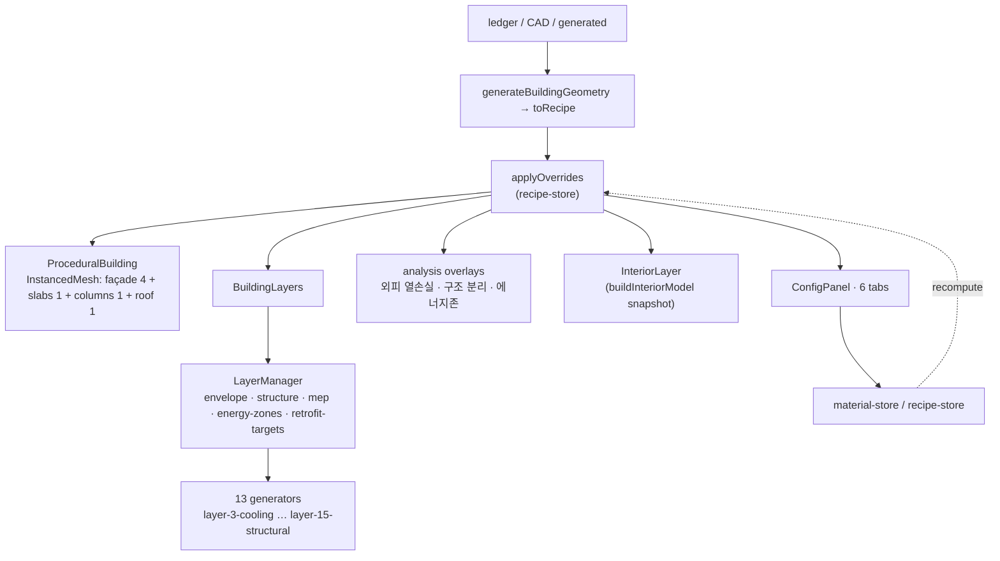

# Digital Twin Viewer (디지털 트윈)

## Purpose

Turn the register row and the uploaded drawing into a navigable 3D building, so
the user can see **where** energy is lost — not only how much.

## User / System Outcome

The building appears as procedural massing with a façade, slabs, columns and a
roof. The user toggles layers (외피 / 구조 / MEP / 에너지존 / 개선 대상), clicks
geometry to select a real element, switches to plan or elevation views, and types
into the 설정 panel to change the building — every field recomputing the energy
read-out on the next render.

## Current Status

**implemented** and fully mounted on the main path.
[building-scene.tsx](../../src/components/viewer/building-scene.tsx) is lazily
loaded by `building-workspace.tsx` with `diagnosticsMode = false`, so the
contextual toolbar, config panel, layer panel, analysis legend and twin overlay
are all live.

The same `BuildingScene` is reused by [[Traceable Energy Diagnostics]] with
`diagnosticsMode = true`, which swaps the chrome: `DiagnosticSelectionLayer`
mounts, and `AuthoringFamilyLayer`, `ConfigPanel`, `LayerPanel` and
`TwinStageOverlay` are all suppressed
([building-scene.tsx:557,663,735,744,764](../../src/components/viewer/building-scene.tsx)).

## Workflow

Step 3 — 디지털 트윈. `WorkspaceShell` renders the 3D children for `twin` (and
for `search`); stages `upload`, `params` and `report` replace the viewport with
their own lazy component instead.

## Architecture

There are only **five** user-visible `LayerId`s: `envelope`, `structure`, `mep`,
`energy-zones`, `retrofit-targets` — with envelope + structure on by default and
the rest off. `MepSubLayerId` adds seven sub-groups (electrical, hvac, lighting,
dhw, safety, transport, gas). The 15 numbered `layer-*.ts` generators feed those
five groups; they are not five more toggles.

Three **analysis overlays** live in a separate `analysisOverlays` slice, off by
default, because they are physics read-outs drawn on top of the twin rather than
twin geometry. 내부 요소 (the solved interior) is a fourth, snapshot-driven
toggle, also off by default — the massing shell is opaque, so it is geometry the
user has to ask to see.

The solved interior in [src/lib/interior/](../../src/lib/interior) is pure data:
metres everywhere, Y-up right-handed world XZ sharing the footprint origin,
world Y from `BimLevel.elevation` (never `placement.y`), `rotationY` **derived**
via `headingYFromAxis(atan2(-dz, dx))` because generated walls store the
opposite-sign plan angle, openings cut by splitting walls into piers/sill/header
bands rather than CSG, and deterministic to 6 dp. No three/React/DOM imports.

## State Ownership

`building-scene.tsx` is the single largest coupling point in the render path —
781 lines, 65 imports, seven stores plus `useViewStore`:

- `useLayerStore` (persist `bim-layer-store`) — visibility, density, analysis overlays, interior toggle. `structuralIsolation` is session-only.
- `useMaterialStore` (persist `bim-material-properties`) / `useRecipeStore` (persist `bim-recipe-overrides`) — what the config panel writes.
- `useSelectionStore` — `SelectedEquipmentInfo` is documented as strictly plain JSON: it **must not** hold any `THREE.Object3D`, `Vector3` or other `THREE.*` instance, because storing them leaks GPU memory when `LayerManager` rebuilds the MEP group.
- `useOutlineStore`, `useReviewHighlightStore`, `useEquipmentStore`, `useWorkspaceStore`, `useTwinProvenanceStore`
- `useViewStore` (persist `bim-view-store`, defined in `src/lib/bim/views/`) — plan / elevation / 3D view definitions.

## Implementation

- [building-scene.tsx](../../src/components/viewer/building-scene.tsx) — the R3F `<Canvas>` owner
- [procedural-building.ts](../../src/lib/procedural/procedural-building.ts) — pure Three.js, no React
- [layer-manager.ts](../../src/lib/layers/layer-manager.ts) · [types.ts](../../src/lib/layers/types.ts)
- [layer-panel.tsx](../../src/components/viewer/layer-panel.tsx) — the five layers, three overlays and the interior toggle
- [config-panel.tsx](../../src/components/viewer/config-panel.tsx) + [config-tabs/](../../src/components/viewer/config-tabs) — building · envelope · systems · equipment · layers · energy
- [equipment-assets.ts](../../src/lib/equipment-assets.ts) — preloaded GLB cache
- [build.ts](../../src/lib/interior/build.ts) — the solved interior

## Relevant Tests

- [e2e/plan-view.spec.ts](../../e2e/plan-view.spec.ts) — source plan ↔ 3D round-trip, and explicitly asserts no `THREE.Clock` warnings
- [e2e/building-flow.spec.ts](../../e2e/building-flow.spec.ts) — `/building/demo` renders, energy-cards DOM
- `src/lib/procedural/__tests__/` — polygon slab instancing, geometry fit, slab overhang, roof surface, structural kit, Korean typology
- `src/lib/layers/__tests__/` — per-layer generators plus the three analysis overlays
- `src/lib/interior/__tests__/` — `interior-model`, `walls`, `visible-floors`, `view-select`

## Failure Modes

- The 7-draw-call budget holds only on the **rectangular InstancedMesh path**. A
  polygon footprint falls back to per-face `Group`s and emits more. (That figure
  is quoted from the class comment; no draw-call measurement has been taken.)
- `setMatrixAt` must always be followed by `instanceMatrix.needsUpdate = true` —
  a repeated bug shape, present at 10+ call sites.
- Layer generators run synchronously, so `equipment-assets.ts` preloads once and
  then serves **deep clones** (geometry *and* materials) — `BuildingLayers` and
  `ProceduralBuilding` dispose both on every regeneration. A cache miss falls
  back to coarse procedural geometry rather than breaking the scene.
- `useTexturedMaterial` must always return a roughness value: Three.js defaults
  it to 1.0 when `roughnessMap` is present but the prop is omitted.
- Zustand persist + SSR: `WorkspaceShell` renders a skeleton until
  `useHydration()` is true.

## Known Limitations

- Whether all 15 MEP generators actually emit geometry for a typical
  ledger-derived recipe is unverified — output depends on density and equipment
  params that were not exercised.
- The campus / portfolio branch inside `BuildingScene` still exists, but
  `campusData` is never passed by `building-workspace.tsx`, so campus mode
  cannot be entered.
- 3D authoring is unreachable: `AuthoringFamilyLayer` returns `null` unless
  `workMode === "authoring"`, `"authoring"` is not one of the five rail modes,
  and the only component that could set it has no importer. See
  [[BIM Document Model]].
- The 2D plan-symbol library renders only at `/dev/symbols`; its product mount
  point sits inside the unmounted generative studio.

## Related Systems

[[Twin Energy Model]] · [[BIM Document Model]] · [[Retrofit Economics]] · [[CAD Drawing Ingest]] · [[Traceable Energy Diagnostics]]
