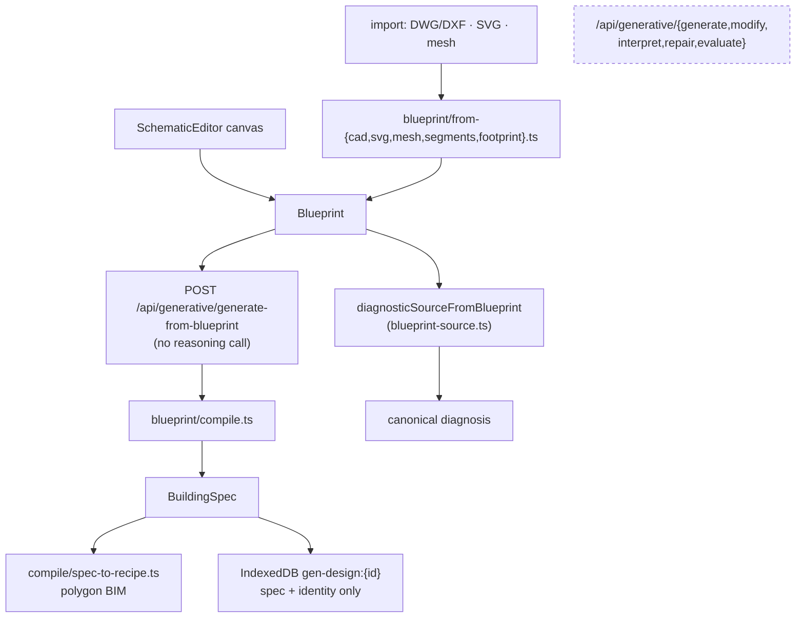

# Generative Schematic Engine

## Purpose

Let someone **without a register row** reach a diagnosis: draw an outline, or
import a DWG/DXF/SVG/mesh, and get a polygon BIM model out of it.

## User / System Outcome

The user draws a schematic on a 2D canvas (or imports one), and the engine
compiles it deterministically into a `BuildingSpec` and then a polygon-footprint
building — massing, storeys, cores — which enters the canonical diagnosis.

## Current Status

**partial.** The deterministic half is live; the LLM half is retained but
unreachable.

**Live:**
- `SchematicEditor` is mounted by
  [energy-diagnostic-product.tsx:200](../../src/components/energy-diagnostics/energy-diagnostic-product.tsx)
  for `method=create` and `method=upload`.
- It calls `generateFromBlueprint` → `POST /api/generative/generate-from-blueprint`,
  a route whose own header states it makes **no reasoning call** because a
  blueprint is already semantic. **The drawing path therefore works with no
  `ANTHROPIC_API_KEY`.**
- Its import dialog reads DWG/DXF (via `CadDocument`), SVG (via `from-svg.ts`,
  reading `line`/`polyline`/`polygon`/`rect`/`path` and counting layers in
  **edges**, not entities) and 3D-mesh DXF/DWG.

**Unreachable:**
- `/studio` is now a pure redirect shim: `start=draw` → `/diagnostics/new?method=create`,
  `start=diagnose` → `?method=upload`, else `/diagnostics/new`.
- `generative-studio.tsx` has **no importer outside its own test**, so the prompt
  panel, command bar, history/diff/review panels and `PlanOverlay` are not
  mounted anywhere.
- Consequently the five LLM-backed routes — `/api/generative/{generate, modify,
  interpret, repair, evaluate}` — have **no reachable UI caller**. Only
  `generate-from-blueprint` is called from mounted code.

82 test files under `src/lib/generative` keep the engine green regardless.

## Workflow

**Off the four-step spine.** It is an alternative *entry* into
[[Traceable Energy Diagnostics]], not a workflow stage. A generated design gets a
`GEN-\d{4}(\.\d+)?` id, a shape a numeric 관리번호 can never collide with;
`/building/GEN-*` redirects to `/diagnostics/new?method=create`.

## Architecture

`src/lib/generative/` is the largest subsystem in the repo — 65 files,
~25 000 lines. Ids are deterministic: `rng.ts` is seeded from the prompt and
there is no `Date.now()` or `Math.random()`, so the same drawing actions always
yield the same blueprint. `design-storage.ts` stores **only** the spec plus
identity, because `buildDesign` is pure given `(spec, buildingPk, generationId,
locks)`.

Provider selection lives in `provider/index.ts`: `BIM_REASONING_PROVIDER` forces
`claude` or `heuristic`; otherwise Claude when a key is present and the
deterministic offline `HeuristicReasoningProvider` when not — the stated
principle is that *a missing key degrades to a working building rather than a
dead button*. `claude-provider.ts` is `import "server-only"` and forces a tool
call whose `input_schema` is generated from the same Zod schema that validates
the reply, so there is no prose or fenced-JSON parsing.

## State Ownership

- `useBlueprintStore`, `useGenerativeSessionStore` — both deliberately **not**
  persisted (each carries an in-file comment saying why).
- IndexedDB `gen-design:{id}` — the spec.
- `energy/publish-design.ts` and `workspace-handoff.ts` are the **store-writing
  handoff seam** into the twin: they write `active-building`, `material`,
  `recipe`, `layer` and `workflow` stores. These are two of only nine places
  where `src/lib/**` imports from `src/store/**`.

## Implementation

- [schematic-editor.tsx](../../src/components/generative/schematic/schematic-editor.tsx) — the one component the routed product still uses from this folder
- [blueprint/compile.ts](../../src/lib/generative/blueprint/compile.ts) · [blueprint/from-svg.ts](../../src/lib/generative/blueprint/from-svg.ts) · [blueprint/from-cad.ts](../../src/lib/generative/blueprint/from-cad.ts)
- [generate-from-blueprint/route.ts](../../src/app/api/generative/generate-from-blueprint/route.ts) — SSE, `maxDuration 300`, `force-dynamic`
- [provider/index.ts](../../src/lib/generative/provider/index.ts) — `providerStatus()` exposes name/fallback/model without secrets
- [design-storage.ts](../../src/lib/generative/design-storage.ts) · [workspace-handoff.ts](../../src/lib/generative/workspace-handoff.ts)
- [blueprint-source.ts](../../src/lib/energy-diagnostics/blueprint-source.ts) — the diagnosis adapter

## Relevant Tests

- `src/lib/generative/__tests__/` (66 files): `blueprint-compile`, `blueprint-from-{cad,svg,mesh,segments,footprint}`, `blueprint-import-{cad,svg}`, `blueprint-validate`, `blueprint-fidelity`, plus five `acceptance-*` suites (podium-tower, multi-courtyard, massing-chain, required-shapes, locks-and-stability)
- [claude-provider.test.ts](../../src/lib/generative/__tests__/claude-provider.test.ts) — plus `claude-provider.live.test.ts`, gated by `describe.skipIf(!LIVE)` on `RUN_LIVE_API === "1"` (the one wholly-skipped file in the suite)
- [e2e/energy-diagnostics.spec.ts](../../e2e/energy-diagnostics.spec.ts) — "authored geometry enters validation and the real diagnostic engine"; "a genuine reviewed DWG reaches the canonical engine"
- `src/test/server-only-stub.ts` is what makes the `import "server-only"` modules testable in Node at all (aliased in `vitest.config.ts`).

## Failure Modes

- No `ANTHROPIC_API_KEY` → the heuristic provider takes over for the LLM routes;
  the schematic path is unaffected because it never reasons.
- An SVG whose layers are counted by entity rather than by edge would mis-rank
  candidate outlines — hence the edge-counting rule in `from-svg.ts`.
- A blueprint with multiple outline loops is passed through intact;
  [[Traceable Energy Diagnostics]] stops at `ambiguous_boundary` rather than
  picking a loop for the user.

## Known Limitations

- The prompt-driven studio, history/diff/review panels and the `PlanOverlay` are
  **not mounted**. Anyone reading the 8 675-line `components/generative` folder
  will overestimate the shipped surface: exactly one component from it is used by
  the routed product.
- `/api/generative/interpret` has no client caller in `src` at all — only a route
  test.
- Historical rationale for retaining the studio is not established.

## Related Systems

[[Traceable Energy Diagnostics]] · [[CAD Drawing Ingest]] · [[Digital Twin Viewer]]
