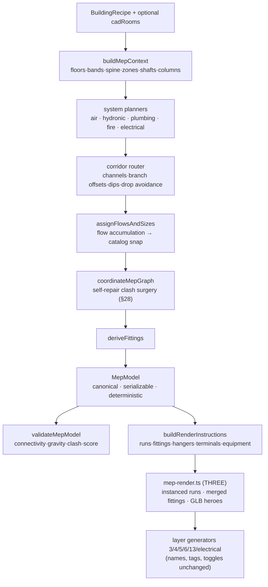

# MEP Systems (기계전기설비)

## Purpose

Give the twin's 기계전기설비 layer real engineering: building services that
exist as a **canonical network graph** — plant → riser → floor main → branch →
terminal — with engineered sizes, explicit fittings, coordination, clash QA
and per-element provenance, rendered as BIM-quality geometry. Before
2026-08-31 the layer was fifteen decorative generators drawing constant-size
splines and boxes at hardcoded footprint fractions.

## User / System Outcome

Toggling 기계전기설비 shows coordinated duct/pipe/tray networks whose topology
is real (every diffuser traces to its AHU, every fixture to a stack, every
circuit to a panel), whose sizes come from flow accumulation snapped to real
catalogs, and whose elements answer for themselves on click: system, role,
size, design flow, and the basis of every number (계산값/추정값/규격 기본값/
도면 근거/사용자 입력). A CAD plan uploaded in step 2 replaces the procedural
zone grid with the drawing's classified rooms.

## Architecture

- `src/lib/mep/` — the engine. `planMepSystemsForRecipe(recipe)` is the
  entry the layer generators call; memoized by an input fingerprint so six
  layers pay for one plan. Deterministic: no RNG anywhere (§41).
- `src/lib/mep/rules.ts` — every constant cites a rule id in
  [[MEP Design Practice Research]] with a U/H/C/M classification.
- Archetypes from 주용도 × era (rule KR-10): `central-ahu` (pre-2000 office),
  `vrf` (post-2000 office), `residential-hydronic` (공동주택 — underfloor
  loops, exhaust stacks, no ducted supply), `packaged` (근생/판매).
- Coordination is layered: elevation bands per trade (rule Z1), plan channels
  and branch-line offsets per system (Z4/Z5), deterministic dips at known
  same-band crossings (§15), then a bounded self-repair pass that locally
  displaces the smaller run at residual hard clashes (§28). Residuals are
  counted honestly by the validator, never hidden.
- `src/lib/layers/mep-render.ts` — shared renderer: per-system instanced
  cylinders/boxes (per-instance size via non-uniform scale), one merged
  fitting mesh per system (torus elbows, tee collars, reducer cones, valves),
  instanced hangers at real intervals, diffuser/grille terminal devices, GLB
  equipment heroes with primitive fallback. Per-instance metadata rides
  `userData.mepPerInstance` (plain JSON) for the selection stack.
- CAD-driven path: `roomPolygonsFromPlan` (classify-plan.ts) →
  `RecipeOverrides.cadRooms` (upload stage) → `MepZone.source = "cad-room"`.
  Rooms are drawing evidence; the grid is a labelled procedural guess.
- Inspection (§25): `SelectedEquipmentInfo.mep` carries the element's system,
  role, size, flow and basis into the equipment info panel (배관·덕트 정보
  block, with an explicit "설계 추정값" disclaimer per §44).
- **설비 강조 (MEP x-ray)** — the product's way to *see* all of this: a
  toggle under 기계전기설비 in both the scene layer list and the layer panel
  (`mepIsolation`, session-only). Entering it ghosts the entire massing
  (same Solibri/Navisworks convention as 구조 분리), forces the MEP layer on,
  and clears the interior snapshot + analysis overlays so the coordinated
  services are the subject. Leaving it restores nothing behind the user's
  back.
- `/dev/mep` — visual-QA harness: the six QA buildings (§31), color modes
  (system / provenance / clash), the connectivity-graph overlay, and live
  validator metrics. Not linked from the product.

## Engineering QA (§33/§34)

`validateMepModel` reports connectivity completeness, orphan segments,
gravity monotonicity for drainage, riser verticality, axis discipline, AABB +
exact round-round clash detection (hard vs clearance), equipment-clearance
violations, bends per terminal path, and a 90-point auto plausibility score
(the 10 visual points are deliberately human-scored, §35).

Regression thresholds live in `src/lib/mep/__tests__/mep-engine.test.ts` and
ratchet downward only. 2026-08-31 measured state (from ~4,000 hard clashes
before coordination):

| Case | Archetype | Hard clashes | Auto score /90 |
|---|---|---|---|
| A small office | vrf | 0 | 71.2 |
| B 12F office | vrf | 0–36 | 68.6 |
| C 15F apartment | residential | ≤80 | 71.5 |
| D retail | packaged | ≤100 | 65.7 |
| E 1990s central plant | central-ahu | ≤500 | 58.9 |
| F L-shape CAD rooms | vrf | 0 | 75.4 |

Structure clashes (columns, hoistways) are asserted at **zero** for all six.

## Relevant Tests

- `src/lib/mep/__tests__/mep-engine.test.ts` — the six-case engineering suite
- `src/lib/layers/__tests__/` — graph-driven generator suites (rewritten
  2026-08-31 to assert connectivity-derived behaviour, not scene-graph trivia)
- e2e unchanged and green (the render contract — group names, userData tags,
  sub-layer toggles, airflow-streamlines — was deliberately preserved)

## Known Limitations

- **Case E residuals**: the pre-2000 central-plant archetype stacks seven
  trades in a ≤1 m ceiling void; a few hundred small-pipe hard clashes
  (2–8 cm) remain after self-repair. Next lever: a second corridor channel
  plan (dual-spine) or per-floor congestion-aware channel assignment.
- **Planning cost**: dense towers (case E) plan in ~10–20 s — fine for a
  one-shot per recipe (memoized), but §42 local regeneration is not
  implemented; any recipe change replans the whole building.
- Condensate drainage from FCUs/cassettes is not modelled (labelled
  assumption). Low-voltage/BAS/telecom/gas/transport/waste layers still use
  the pre-graph generators.
- GLB origin conventions are a hand-maintained set (`BASE_ORIGIN_ASSETS` in
  mep-render.ts); a wrong entry sinks or floats a hero by half its height.
- MEP click-selection is awkward while interior/structure layers are on
  (occlusion-correct raycasting prefers the nearer surface) — hover works
  everywhere; 설비 강조 is the intended way to inspect the services.
- IFC: node/segment kinds map conceptually to IfcDistributionSystem /
  IfcFlowSegment / IfcFlowFitting / IfcFlowTerminal but no serializer is
  wired; the existing IFC engine remains massing-only.

## Related Systems

[[Digital Twin Viewer]] · [[CAD Drawing Ingest]] · [[Twin Energy Model]] ·
[[MEP Design Practice Research]] · [[MEP Pipeline - Current vs Target]]
