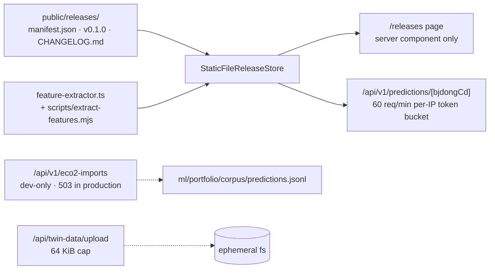

# Prediction Data Product (/releases · /api/v1)

## Purpose

Publish calibrated per-region energy predictions as a **versioned dataset**, and
ingest real-world corpora (ECO2 model files, energy bills, floor plans,
equipment schedules) to calibrate against.

## User / System Outcome

An operator or data consumer browses published releases at `/releases`, sees what
each version contains, and fetches predictions for a 법정동 from
`/api/v1/predictions/{bjdongCd}`.

## Current Status

**experimental, and deliberately walled off from the product.**

- `/releases` is **server-component-only by design** — no `"use client"`, no
  sliders, no in-browser prediction. Its purity is enforced by a CI guard
  (`scripts/ci-check-plan.mjs`, "explorer-purity" check, an anchored regex so
  prose mentioning the phrase does not trip it).
- It **refuses to fabricate a row count**: it probes the predictions file and
  reports availability rather than asserting a number.
- A `v0.1.0` release exists on disk under `public/releases/`.
- **Not linked from the product UI**, and no mounted component calls
  `/api/v1/*` or `/api/twin-data/*`. These are operator surfaces, not user
  features.

## Workflow

**Not on the four-step spine at all.** It neither reads from nor writes to the
twin. Include it in any survey of the repo only to explain why `src/lib/portfolio`
and `/api/v1` exist.

## Architecture

`StaticFileReleaseStore` reads `public/releases` **at request time** — the page
is `export const dynamic = "force-dynamic"` — so a new release appears without a
rebuild.

`scripts/extract-features.mjs` carries a **parity note**: it mirrors
[src/lib/portfolio/features.ts](../../src/lib/portfolio/features.ts) and both
must stay in sync. `pnpm ci:check` enforces a related guard — the committed
`schema.json` of the latest release must match a fresh run of
`export-feature-schema.mjs`, compared after normalising CRLF→LF (git may check
the frozen JSON out with CRLF on Windows while the exporter always emits LF).

A third guard makes releases **immutable**: files under `public/releases/v*/`
(except `CHANGELOG.md`) must be unchanged versus HEAD, and the check unions
`git ls-files --others --exclude-standard` into the changed set, because
`git diff` never lists untracked files and a brand-new file dropped into a frozen
release directory would otherwise pass undetected.

## State Ownership

No client store. State is the **filesystem**: `public/releases/` for published
data, `ml/portfolio/corpus/` for the ingested corpus.

## Implementation

- [releases/page.tsx](../../src/app/releases/page.tsx) — the server-only explorer
- [release-store.ts](../../src/lib/portfolio/release-store.ts) · [feature-extractor.ts](../../src/lib/portfolio/feature-extractor.ts)
- [predictions/[bjdongCd]/route.ts](../../src/app/api/v1/predictions/[bjdongCd]/route.ts)
- [eco2-imports/route.ts](../../src/app/api/v1/eco2-imports/route.ts) · [twin-data/upload/route.ts](../../src/app/api/twin-data/upload/route.ts)
- [twin-data/guards.ts](../../src/lib/twin-data/guards.ts) — slug validation, containment-checked path resolution, constant-time key compare, 64 KiB body cap
- `scripts/ci-check-plan.mjs` — the three guards described above

## Relevant Tests

- [release-store.test.ts](../../src/lib/portfolio/__tests__/release-store.test.ts) · [feature-extractor.test.ts](../../src/lib/portfolio/__tests__/feature-extractor.test.ts) · [features.test.ts](../../src/lib/portfolio/__tests__/features.test.ts) · [extract-features-cli.test.ts](../../src/lib/portfolio/__tests__/extract-features-cli.test.ts) — the CLI/lib parity check
- `src/app/api/v1/predictions/[bjdongCd]/__tests__/`, `src/app/api/v1/eco2-imports/__tests__/`, `src/app/api/twin-data/upload/__tests__/`, `src/app/api/twin-data/[buildingId]/__tests__/`

## Failure Modes

**The write endpoints fail closed.** `/api/twin-data/upload` requires a
`x-twin-data-key` header matching `TWIN_DATA_API_KEY` and returns **401 when that
variable is unset** — it does not silently accept. `/api/v1/eco2-imports` has the
same shape behind `CORPUS_API_KEY` and additionally returns 503 in production
(`NODE_ENV` + `VERCEL` checks), because it writes to a JSONL file.

The GET sibling `/api/twin-data/[buildingId]` is deliberately unauthenticated.

`/api/v1/predictions` uses an in-memory 60 req/min per-IP token bucket — same
per-instance caveat as the register rate limiter.

## Known Limitations

- The corpus write path is a **stopgap**: its own header says the production path
  awaits blob storage, because a serverless filesystem is ephemeral.
- `public/releases/v0.1.0` exists on disk, but whether the published dataset is
  populated or a placeholder was not verified.
- Nothing in the app consumes these predictions. A prior planning document
  proposed surfacing them in the Twin stage; that direction was abandoned and is
  **not** the current product shape.

## Related Systems

[[Twin Energy Model]] · [[Building Register Search]]
