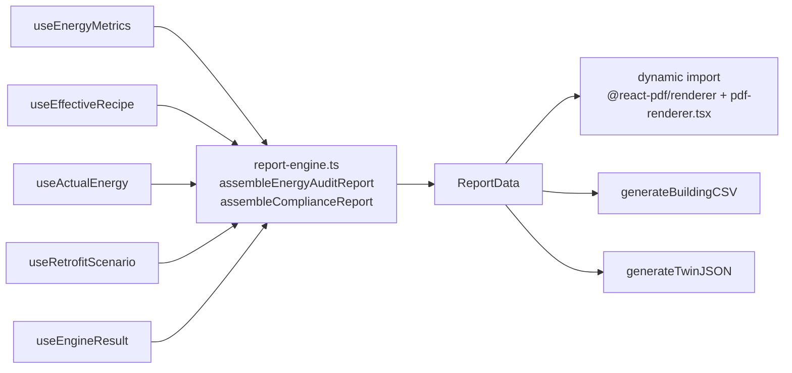

# Report and Export (보고서)

## Purpose

Hand the user a document they can act on or file — not a screenshot of the app.

## User / System Outcome

Four tabs: 에너지 진단, 법규 검토, 일람표, 시트. The user previews the assembled
document and exports it as a Korean-typeset PDF, a CSV of the building data, or a
JSON snapshot of the twin.

## Current Status

**implemented.** `ReportStage` is lazily mounted by `WorkspaceShell` whenever
`stage === "report"`. PDF generation is client-side and the renderer is imported
only on click.

## Workflow

Step 4 — 보고서, the terminal stage of both `STAGE_ORDER` and
`CAD_FIRST_STAGE_ORDER`. It reads whatever the twin currently holds; there is no
separate "generate" step that could go stale.

## Architecture

Two templates drive the PDF: `templates/energy-audit.ts` and
`templates/compliance-report.ts`, producing `energy-audit-*.pdf` and
`compliance-*.pdf`. The PDF button is **deliberately disabled** on the 일람표 and
시트 tabs, which have no template. CSV and JSON export from any tab.

Compliance uses [green-certification.ts](../../src/lib/compliance/green-certification.ts)
and `calculateEfficiencyRating`, so the exported grade is the same official
primary-energy grade the status bar shows.

Fidelity is labelled Level 1 공공데이터 / Level 2 보강 모델 / Level 3 보정 모델
(`FIDELITY_LABELS` in `report-engine.ts`), composed from
[[Twin Fidelity and IFC Engine]].

## State Ownership

`ReportStage` owns only local tab state. Everything else is read through hooks
from `useMaterialStore`, `useRecipeStore`, `useScenarioStore` and the engine /
fidelity hooks. There is no dedicated store and nothing is persisted.

## Implementation

- [report-stage.tsx](../../src/components/report/report-stage.tsx) — the four tabs and the three export buttons
- [report-engine.ts](../../src/lib/report/report-engine.ts) — assembly
- [pdf-renderer.tsx](../../src/lib/report/pdf-renderer.tsx) — side-imports `./pdf-fonts` to register NotoSansKR **before any render** (P0-03); without it Korean glyphs do not render at all
- [csv-export.ts](../../src/lib/export/csv-export.ts) · [json-export.ts](../../src/lib/export/json-export.ts)
- [bim-fidelity-section.tsx](../../src/components/report/bim-fidelity-section.tsx)

## Relevant Tests

- [report-engine.test.ts](../../src/lib/report/__tests__/report-engine.test.ts)
- [pdf-renderer.test.tsx](../../src/lib/report/__tests__/pdf-renderer.test.tsx) — font registration
- [energy-audit-template.test.ts](../../src/lib/report/__tests__/energy-audit-template.test.ts) · [scenario-summary.test.ts](../../src/lib/report/__tests__/scenario-summary.test.ts) · [bim-fidelity-summary.test.ts](../../src/lib/report/__tests__/bim-fidelity-summary.test.ts)
- [report-stage-bim-fidelity.test.tsx](../../src/components/report/__tests__/report-stage-bim-fidelity.test.tsx)

**Gap:** the Playwright suite does **not** cover step 4. No e2e spec exercises
`report-stage.tsx` or the PDF/CSV/JSON export path. The only end-to-end evidence
is a manual QA entry from 2026-08-14, which predates the current workspace.

## Failure Modes

- Missing Korean font registration → glyphs silently drop from the PDF. The
  side-import in `pdf-renderer.tsx` exists solely to prevent this and must not be
  tree-shaken away.
- `@react-pdf/renderer` is heavy; it is dynamically imported on click, so a slow
  first export is expected behaviour, not a hang.
- No engine result available (no footprint, or `footprintSource` is `parcel`) →
  the BIM fidelity section renders an explicit unavailable state rather than a
  fabricated number (AFF-6).

## Known Limitations

- **`dataQualityScore` is hardcoded to `60`** in the export payload
  ([report-stage.tsx:483](../../src/components/report/report-stage.tsx)) rather
  than calling `scoreDataQuality`. The search results table computes a real
  score; the export does not.
- Every number here resolves through `useEnergyMetrics`, i.e. the simplified
  간이 모델 path — see [[Twin Energy Model]]. `report-engine.ts` even types its
  input as `EnergyMetrics` imported *from the hook*, a lib module depending on a
  hook's type, which is how tightly this surface is bound to that path.
- Nothing from [[Traceable Energy Diagnostics]] reaches here. The diagnostics
  workspace has its own result surfaces.

## Related Systems

[[Twin Energy Model]] · [[Retrofit Economics]] · [[Twin Fidelity and IFC Engine]] · [[BIM Document Model]]
