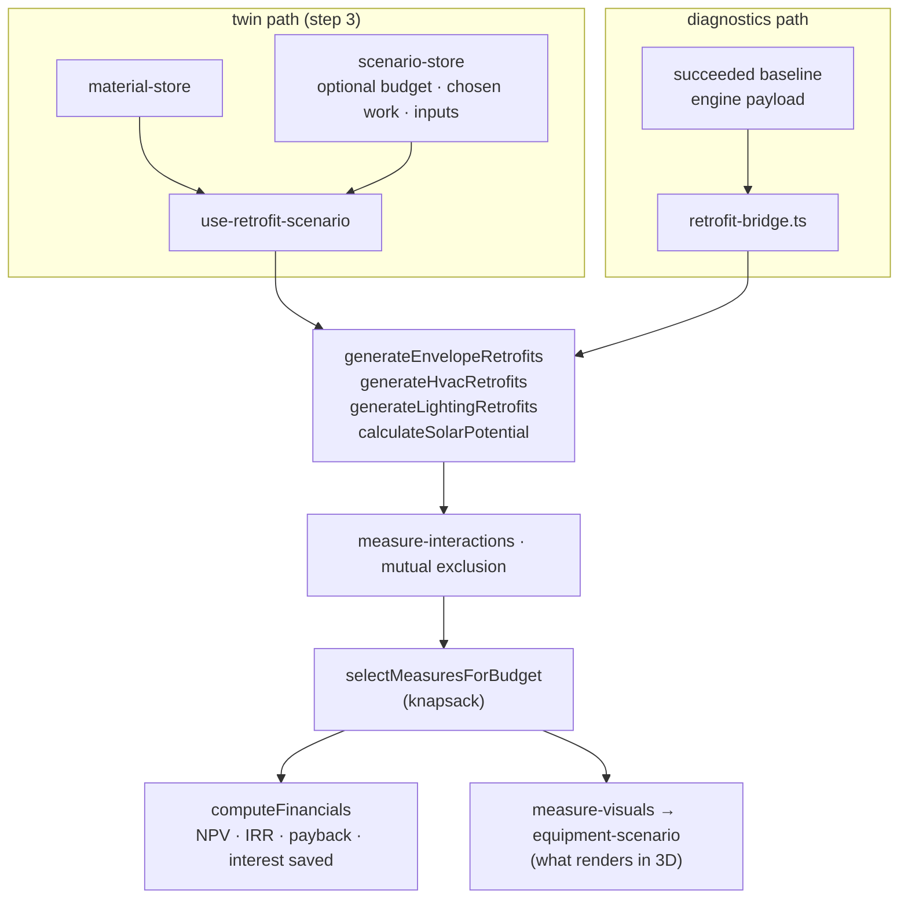

# Retrofit Economics (CAPEX · ROI · 그린리모델링)

## Purpose

Answer *"what should I spend, and what does it earn back"* — the commercial
payload of the diagnosis.

## User / System Outcome

The user chooses retrofit measures and can optionally set an investment budget.
The app recommends measures using NPV (or a budget-constrained selection), while
the user's chosen work drives 3D changes, costs and the energy comparison.
NPV, IRR and discounted payback use the unsubsidized baseline.

The **지원 재원 / support-program feature was removed** at the user's request on
2026-09-07. Neither the twin/reference-model HUD nor the diagnostics economics
panel offers funding tracks. Old `bim-scenario-state` subsidy selections are not
hydrated; all active report, outliner and equipment consumers use the same
unsubsidized hook. The reusable domain finance functions remain available, but
no reachable product control chooses their subsidy presets.

## Current Status

**implemented on both workspaces**, through two independent input paths that
converge on the same generators and the same DCF engine.

## Workflow

Step 3 — 디지털 트윈, as a HUD over the 3D view. Its outputs then flow into
step 4 via `ReportStage`.

**Reachability caveat:** the CAPEX/ROI HUD renders only when
`workMode === "energy"` **and** the active view kind is `3d`
([twin-stage-overlay.tsx:100](../../src/components/twin/twin-stage-overlay.tsx)).
Switching the Revit rail to 뷰 / 주석 / 일람표 / 시트 hides the investment
numbers — deliberately, because the HUD was covering plans, sections and
authoring. The scenario itself still publishes to the store while hidden.

## Architecture

`economic-model.ts` holds the DCF machinery: `effectiveDiscountRate`,
`buildDiscountFactors`, `computeNpv`/`computeNpvScheduled`, `computeIrr`
(`IRR_MAX = 5.0`), `computeDiscountedPayback(Scheduled)`, `projectCashFlow`,
`computeInterestSavedSchedule` (`LOAN_TERM_YEARS = 5`), `computeFinancials` and
the knapsack.

Historic programme presets and their dated research remain in the domain
library. They are not used by the active product economics after removal of the
funding feature. Existing DCF, measure costs, energy prices and savings remain.

## State Ownership

- `useScenarioStore` is session-only. `capexBudgetKrw: number | null` defaults
  to null (no ceiling); `appliedMeasureIds` records the user's chosen work and
  `selectedMeasureIds` is the recommendation. Building changes reset this state.
  There is no `programTrack` field or persistence middleware.
- `useMaterialStore` — the twin path's measure inputs.
- The diagnostics path owns **no** store state. `retrofit-bridge.ts` is
  explicitly pure: it reads only the exact engine payload of a succeeded baseline
  run, never zustand, so every economic figure is anchored to the same inputs the
  user reviewed.

## Implementation

- [economic-model.ts](../../src/lib/retrofit/economic-model.ts) — DCF + knapsack
- [cost-database.ts](../../src/lib/retrofit/cost-database.ts) — KRW costs, energy prices, 그린리모델링 presets
- [use-retrofit-scenario.ts](../../src/hooks/use-retrofit-scenario.ts) — the twin-side bridge
- [retrofit-bridge.ts](../../src/lib/energy-diagnostics/retrofit-bridge.ts) — the diagnostics-side bridge
- [twin-stage-overlay.tsx](../../src/components/twin/twin-stage-overlay.tsx) + `scenario-rail.tsx`, `measure-chip-row.tsx`
- [measure-visuals.ts](../../src/lib/retrofit/measure-visuals.ts) · [equipment-scenario.ts](../../src/lib/layers/equipment-scenario.ts) — money → geometry

## Relevant Tests

- [economic-model.test.ts](../../src/lib/retrofit/__tests__/economic-model.test.ts) · [economic-model-p2-10.test.ts](../../src/lib/retrofit/__tests__/economic-model-p2-10.test.ts)
- [measure-interactions.test.ts](../../src/lib/retrofit/__tests__/measure-interactions.test.ts) — mutual exclusion before knapsack selection
- [measure-visuals.test.ts](../../src/lib/retrofit/__tests__/measure-visuals.test.ts) · [heating-fuel.test.ts](../../src/lib/retrofit/__tests__/heating-fuel.test.ts) · [solar-potential.test.ts](../../src/lib/retrofit/__tests__/solar-potential.test.ts)
- [retrofit-bridge.test.ts](../../src/lib/energy-diagnostics/__tests__/retrofit-bridge.test.ts)

## Existing and proposed PV

The phase seam adds proposed PV to the original installed capacity. For example,
63.36 kWp existing plus a 4 kWp proposal produces 67.36 kWp total. The proposal's
claim, module area and economics cover only the new 4 kWp / 17 m². An installed
array's area of 0 means unavailable: adding 17 m² does not turn that unknown
total into a measured 17 m². A known existing 100 m² instead totals 117 m².

`solarPV.retrofitAddition` retains the original and proposed arrays separately,
with the proposal's module-layout or roof-utilization sizing basis and a named
representative yield assumption. With existing PV, the legacy tilt, orientation
and technology remain the original descriptors; no combined angle or technology
is inferred. Reapplying a proposal does not accumulate it, and a layout that fits
zero new modules leaves the existing PV unchanged. An installed array with
unavailable capacity likewise retains an unknown total alongside the known
proposal.

The degree-day grade path still does not price PV generation. These changes
correct the physical state and the new-work claims; they do not add baseline PV
generation to that engine. The 64 tests across `apply-phase`, `retrofit-delta`
and `measure-claim` verify capacity addition, unknown area, new-only costs,
claim arithmetic, no-room behavior, input preservation and repeat application.

## Failure Modes

- IRR is capped at `IRR_MAX = 5.0`; a degenerate cash flow returns the cap rather
  than diverging.
- Measures must clear mutual-exclusion and interaction rules **before** knapsack
  selection, otherwise the selection double-counts overlapping savings.
- A budget too small for any measure yields an empty set, which the HUD must
  render as an explicit state rather than a zero.

## Known Limitations

- **Two independent input paths.** Both end at the same generators and
  `economic-model`, but from different inputs: the twin reads
  material-store + scenario-store (the 간이 모델 path); diagnostics reads a
  frozen engine payload. They can therefore disagree for the same building.
- `retrofit-bridge.ts` states its own screening limits in `notes`: measure
  savings use the retrofit stack's **closed-form degree-day formulas**, not
  per-measure engine re-runs; prices are the fixed 2024 KRW/kWh constants in
  `cost-database.ts`; lighting hours default to 2 500 h/yr because no canonical
  numeric schedule exists.
- All savings math must stay in `src/lib/retrofit` pure functions — components
  only format. That is a repo-wide architecture fitness function (AFF-4).

## Related Systems

[[Twin Energy Model]] · [[Traceable Energy Diagnostics]] · [[Digital Twin Viewer]] · [[Report and Export]]
