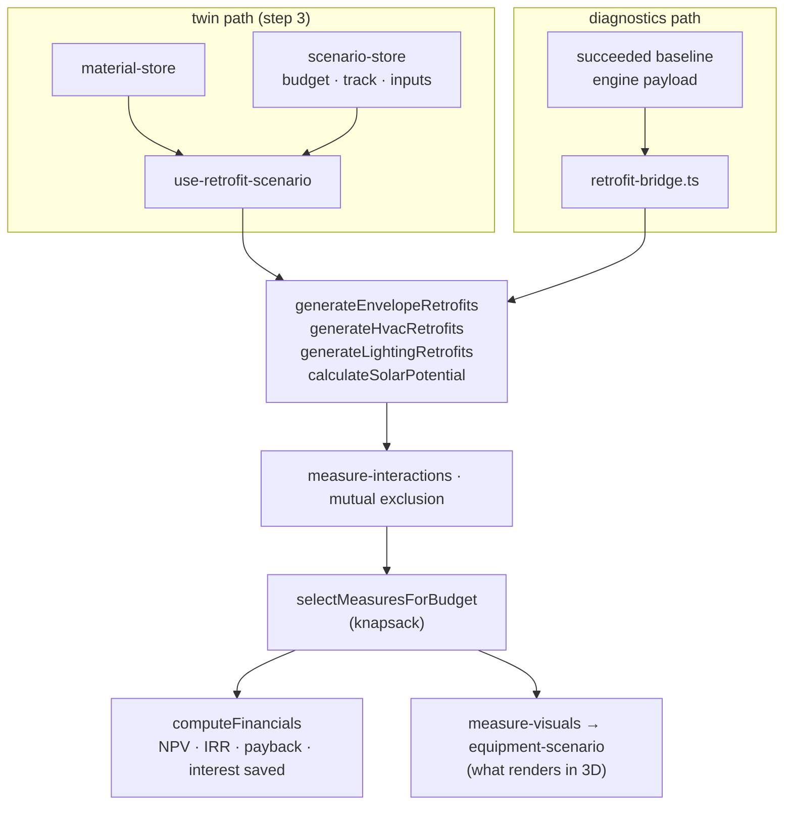

# Retrofit Economics (CAPEX · ROI · 그린리모델링)

## Purpose

Answer *"what should I spend, and what does it earn back"* — the commercial
payload of the diagnosis.

## User / System Outcome

The user sets a CAPEX budget and picks a 그린리모델링 program track. The app
generates candidate measures (envelope, HVAC, lighting, solar), selects a set
that fits the budget, and shows NPV, IRR, discounted payback and interest saved.
The selection also changes **what renders in 3D** — a condensing-boiler cascade
replaces the boiler, fluorescent fixtures become LED, PV appears on the roof — so
the money and the model agree.

## Current Status

**implemented on both workspaces**, through two independent input paths that
converge on the same generators and the same DCF engine.

## Workflow

Step 3 — 디지털 트윈, as a HUD over the 3D view. Its outputs then flow into
step 4 via `ReportStage`.

**Reachability caveat:** the CAPEX/ROI HUD renders only when
`workMode === "energy"` **and** the active view kind is `3d`
([twin-stage-overlay.tsx:100](../../src/components/twin/twin-stage-overlay.tsx)).
Switching the Revit rail to 뷰 / 주석 / 일람표 / 시트 hides the investment
numbers — deliberately, because the HUD was covering plans, sections and
authoring. The scenario itself still publishes to the store while hidden.

## Architecture

`economic-model.ts` holds the DCF machinery: `effectiveDiscountRate`,
`buildDiscountFactors`, `computeNpv`/`computeNpvScheduled`, `computeIrr`
(`IRR_MAX = 5.0`), `computeDiscountedPayback(Scheduled)`, `projectCashFlow`,
`computeInterestSavedSchedule` (`LOAN_TERM_YEARS = 5`), `computeFinancials` and
the knapsack.

**그린리모델링 presets are real programme parameters**, versioned with an
effective date in `cost-database.ts`: 공공건축물 서울·중앙 at 50 % direct
subsidy, 공공 그 외 지자체 at 70 %, and three 민간 interest-support tiers on
70 % LTV over a five-year loan term. `suggestPrivateTrack` picks a tier from the
improvement fraction. Provenance for these figures is the sourced research
dossier in `docs/superpowers/research/2026-04-30-green-remodeling.md`.

## State Ownership

- `useScenarioStore` (persist `bim-scenario-state`) — `capexBudgetKrw`
  (`DEFAULT_CAPEX_BUDGET_KRW = 250,000,000`), `programTrack`, `appliedMeasureIds`
  and the derived `ScenarioBuildingInputs`. The store's own header states why it
  exists: so the `TwinStageOverlay` and the `SceneOutliner` cannot disagree.
- `useMaterialStore` — the twin path's measure inputs.
- The diagnostics path owns **no** store state. `retrofit-bridge.ts` is
  explicitly pure: it reads only the exact engine payload of a succeeded baseline
  run, never zustand, so every economic figure is anchored to the same inputs the
  user reviewed.

## Implementation

- [economic-model.ts](../../src/lib/retrofit/economic-model.ts) — DCF + knapsack
- [cost-database.ts](../../src/lib/retrofit/cost-database.ts) — KRW costs, energy prices, 그린리모델링 presets
- [use-retrofit-scenario.ts](../../src/hooks/use-retrofit-scenario.ts) — the twin-side bridge
- [retrofit-bridge.ts](../../src/lib/energy-diagnostics/retrofit-bridge.ts) — the diagnostics-side bridge
- [twin-stage-overlay.tsx](../../src/components/twin/twin-stage-overlay.tsx) + `capex-input.tsx`, `program-track-selector.tsx`
- [measure-visuals.ts](../../src/lib/retrofit/measure-visuals.ts) · [equipment-scenario.ts](../../src/lib/layers/equipment-scenario.ts) — money → geometry

## Relevant Tests

- [economic-model.test.ts](../../src/lib/retrofit/__tests__/economic-model.test.ts) · [economic-model-p2-10.test.ts](../../src/lib/retrofit/__tests__/economic-model-p2-10.test.ts)
- [measure-interactions.test.ts](../../src/lib/retrofit/__tests__/measure-interactions.test.ts) — mutual exclusion before knapsack selection
- [measure-visuals.test.ts](../../src/lib/retrofit/__tests__/measure-visuals.test.ts) · [heating-fuel.test.ts](../../src/lib/retrofit/__tests__/heating-fuel.test.ts) · [solar-potential.test.ts](../../src/lib/retrofit/__tests__/solar-potential.test.ts)
- [retrofit-bridge.test.ts](../../src/lib/energy-diagnostics/__tests__/retrofit-bridge.test.ts)

## Failure Modes

- IRR is capped at `IRR_MAX = 5.0`; a degenerate cash flow returns the cap rather
  than diverging.
- Measures must clear mutual-exclusion and interaction rules **before** knapsack
  selection, otherwise the selection double-counts overlapping savings.
- A budget too small for any measure yields an empty set, which the HUD must
  render as an explicit state rather than a zero.

## Known Limitations

- **Two independent input paths.** Both end at the same generators and
  `economic-model`, but from different inputs: the twin reads
  material-store + scenario-store (the 간이 모델 path); diagnostics reads a
  frozen engine payload. They can therefore disagree for the same building.
- `retrofit-bridge.ts` states its own screening limits in `notes`: measure
  savings use the retrofit stack's **closed-form degree-day formulas**, not
  per-measure engine re-runs; prices are the fixed 2024 KRW/kWh constants in
  `cost-database.ts`; lighting hours default to 2 500 h/yr because no canonical
  numeric schedule exists.
- All savings math must stay in `src/lib/retrofit` pure functions — components
  only format. That is a repo-wide architecture fitness function (AFF-4).

## Related Systems

[[Twin Energy Model]] · [[Traceable Energy Diagnostics]] · [[Digital Twin Viewer]] · [[Report and Export]]
