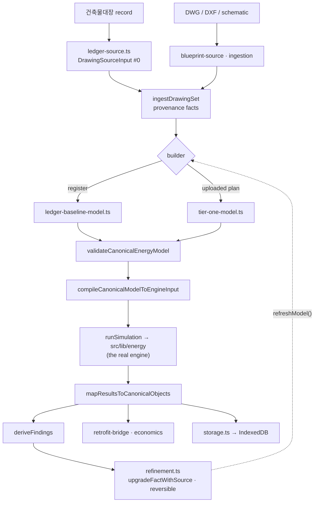

# Traceable Energy Diagnostics

## Purpose

The product's **credibility layer**. Every number in a diagnosis is either a fact
with a real source reference, a named reversible assumption, or explicitly
missing. Nothing in between is invented.

## User / System Outcome

A user arrives with a register row, a DWG/DXF, or a schematic they drew. The app
builds a canonical energy model in which every input can be clicked back to its
origin — "this U-value is a 1990s-era table default, not a measurement" — runs it
through the real engine, and produces findings, improvement scenarios and
retrofit economics anchored to exactly the inputs the user reviewed. Assumptions
can be replaced with the user's own value, and that replacement is recorded as
*the user's input*, not as a measurement.

## Current Status

**implemented and well tested** — 26 lib modules (~13 000 lines), 21 component
files (~7 800 lines), 18 unit test files under `src/lib/energy-diagnostics/`,
10 under the components folder, plus three dedicated e2e specs.

**But it is a second workspace, not step 3.** It lives at `/diagnostics/new`,
reachable via `?method=ledger|upload|create|sample|resume`. The route redirects
to `/` when no method is given and when `method=ledger` arrives without a
building id, so it is never a second landing page. The four-step twin does not
call it — see [[Twin Energy Model]].

## Workflow

Off-spine. It reuses step 1's register record and step 2's drawing formats, and
reaches the same retrofit economics as step 3, but it has its own phase list:

```text
drawings → model → preflight → simulation → compare
```

(asserted verbatim by [e2e/energy-diagnostics.spec.ts](../../e2e/energy-diagnostics.spec.ts)).

## Architecture



**Provenance is a construction-time invariant, not a convention.**
[`createEnergyFact`](../../src/lib/energy-diagnostics/facts.ts) throws
`Fact ${key} needs source evidence, user input, or an assumption.` whenever a
non-missing fact has no `sourceRefs`, no `assumptionId`, and
`extractionMethod !== "user_input"`. It also throws for a missing fact carrying a
value, and for a non-missing fact carrying `null`. `collectEnergyFacts` adds two
more throws for unknown assumption ids and untraceable origins. `SOURCE_PRIORITY`
ranks eight authority levels, 1 = `user_confirmed_project_value` down to
8 = `regional_or_engine_default`.

**Two builders, deliberately siblings — never extensions.**
`ledger-baseline-model.ts` documents that sharing a `modelVersion` prefix or an
assumption id with `tier-one-model.ts` would trip Tier-1's acceptance gate in
`validation.ts`. The register builder names its assumptions explicitly:
`LEDGER_ENVELOPE`, `SYSTEMS`, `USAGE`, `BASEMENT`, `ERA_UNKNOWN`, `FOOTPRINT`.

**The register enters as source document #0** of the same `DrawingSet` that later
receives DWG/DXF/schematics. Routing it through `ingestDrawingSet` rather than a
private side door is precisely what makes the invariant hold for ledger-derived
models too.

`adapter.ts` imports the real engine (`calculateHeatLoss`,
`calculateAnnualDemand`, `calculateSystemBreakdown`, `getClimateData` from
`src/lib/energy`) rather than reimplementing physics. The barrel `index.ts`
deliberately omits `ledger-baseline-model`, `ledger-source`, `refinement`,
`retrofit-bridge`, `blueprint-source` and the reference-office modules — those
are imported by explicit path.

## State Ownership

- **IndexedDB** via idb-keyval, two namespaces:
  `bimfit:energy-diagnostics:project:v2:{projectId}` holding the model envelope,
  and `bimfit:energy-diagnostics:source:v1:sha256:{hash}` holding
  content-addressed original drawing bytes. The v1 project envelope is retained
  as an explicit read contract. Error codes: `SOURCE_HASH_MISMATCH`,
  `CORRUPT_SOURCE`, `UNSUPPORTED_VERSION`, `MIGRATION_FAILED`.
- Component-local model/scenario state in `energy-diagnosis-workspace.tsx`.
- `useSelectionStore` — `CanonicalSelectionKind` = `energy_fact | thermal_zone |
  source_reference | diagnostic_finding | simulation_series`, which is how a
  fact selected in the data panel highlights in the shared 3D scene.

## Implementation

- [facts.ts](../../src/lib/energy-diagnostics/facts.ts) — the invariant
- [ledger-baseline-model.ts](../../src/lib/energy-diagnostics/ledger-baseline-model.ts) · [tier-one-model.ts](../../src/lib/energy-diagnostics/tier-one-model.ts)
- [ledger-source.ts](../../src/lib/energy-diagnostics/ledger-source.ts) — states in its header exactly what the register does **not** contain
- [adapter.ts](../../src/lib/energy-diagnostics/adapter.ts) — the engine seam
- [refinement.ts](../../src/lib/energy-diagnostics/refinement.ts) · [validation.ts](../../src/lib/energy-diagnostics/validation.ts) · [findings.ts](../../src/lib/energy-diagnostics/findings.ts)
- [model-operations.ts](../../src/components/energy-diagnostics/model-operations.ts) — the orchestration seam; every refinement must end with `refreshModel()`
- [viewer-bridge.ts](../../src/lib/energy-diagnostics/viewer-bridge.ts) — canonical model → `BimElement` under the `energy-diagnostics:` id prefix
- Domain references: [assumption-catalog.md](../assumption-catalog.md) · [design-stage-energy-diagnostics.md](../design-stage-energy-diagnostics.md) · [energy-input-source-map.md](../energy-input-source-map.md)

## Relevant Tests

- [e2e/ledger-baseline.spec.ts](../../e2e/ledger-baseline.spec.ts) — builds and runs a baseline with zero further input; reports every registered storey, not a single extruded plate; **declines a building it cannot model instead of inventing one**
- [e2e/ledger-refinement.spec.ts](../../e2e/ledger-refinement.spec.ts) — a corrected value is recorded as the user's, not as a measurement
- [e2e/energy-diagnostics.spec.ts](../../e2e/energy-diagnostics.spec.ts) — 10 tests, 595 lines: DXF blocked until Tier-1 assumptions are accepted, cancel-import preserves the running diagnostic, state survives reopen
- [facts.test.ts](../../src/lib/energy-diagnostics/__tests__/facts.test.ts) · [ledger-baseline-model.test.ts](../../src/lib/energy-diagnostics/__tests__/ledger-baseline-model.test.ts) · [ingestion-boundary-provenance.test.ts](../../src/lib/energy-diagnostics/__tests__/ingestion-boundary-provenance.test.ts)

## Failure Modes

Four documented traps, each with a regression test:

1. **ACH50 ÷ 20.** `AIRTIGHTNESS[era]` is a blower-door figure; the natural
   air-change rate is `AIRTIGHTNESS[era] / 20`. Feeding ACH50 straight in
   overstates infiltration twentyfold.
2. **Silent era default.** `classifyEra` returns `"1990-1999"` for a blank date.
   The traceable path uses `classifyEraExplicit`
   ([floor-rows.ts:115](../../src/lib/ledger/floor-rows.ts)) so an unknown era
   becomes the named `ERA_UNKNOWN` assumption instead of a plausible-looking guess.
3. **A documented zero must emit no fact at all** — a register zero means
   unavailable, so recording it as a value would launder a gap into a datum.
4. **Boundary provenance.** Ingestion once stamped every supplied boundary as
   `dimensioned_vector_geometry`, which would relabel a synthesised rectangle as
   a survey.

Tier-1 can also refuse: an authored blueprint with multiple outline loops stops
at `ambiguous_boundary` rather than picking a loop for the user.

## Known Limitations

- **Below-grade storeys are recorded but not extruded**, because
  `envelopeQuantities` prices every storey against outdoor air and there is no
  ISO 13370 path. The excluded m² is named rather than hidden.
- **The VWorld outline is not wired in.** `use-ledger-record.ts` carries an
  explicit comment: that polygon is in lon/lat **degrees**, and reaching fidelity
  L1 honestly means projecting it to metres, not handing degrees to a builder
  that expects metres. Until then the baseline uses an outline derived from
  건축면적 under a named assumption. The receiving seam already exists —
  `ledger-source.ts` accepts `{ kind: "vworld_building"; ringM: Polygon2D }` and
  `ledger-baseline-loader.tsx` exports `rebuildLedgerBaselineWithFootprint`.
- `energy-diagnosis-workspace.tsx` is a single 2 863-line component importing
  nine lib modules and twelve sibling panels.
- The version strings in the contract table are **compatibility identifiers**,
  not claims that an external simulation program was executed.

## Related Systems

[[Twin Energy Model]] · [[Building Register Search]] · [[Generative Schematic Engine]] · [[Retrofit Economics]] · [[Digital Twin Viewer]]
