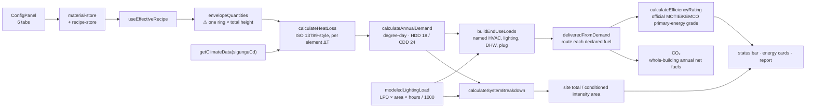

# Twin Energy Model (the 간이 모델 path)

## Purpose

Recompute the building's energy profile **live** as the user types into step 3.
This is the calculation behind every number the twin, the status bar, the CAPEX
HUD and the report show.

## User / System Outcome

The user drags 벽체 열관류율, 창호 열관류율, SHGC, 창면적비, 지붕/바닥 열관류율
or ACH50, and the annual demand, the efficiency grade and the CO₂ intensity move
on the next render. No save, no submit, no round trip.

## Current Status

**2026-09-15 local verification — Phase 01, Plan 01:** lighting now uses
`LPD × conditioned intensity area × annual operating hours / 1000` in both
the primary-energy grade and whole-building site total. The energy card and
reference-model grade explanation display that site total per conditioned area.
The new shared disclosure shows the actual equation and distinguishes use-code
defaults, user inputs, assumed LED targets and unrecorded sources. Operating
hours are separately stated as assumptions, including unmatched-code fallback.

**Plan 02, also verified locally on 2026-09-15:** one `ClimateRegion` now reaches
retrofit/PV consumers; the scenario store resolves the code/address at publication.
Unknown locations withhold PV and visibly name the legacy thermal fallback.
Generated designs without a location no longer manufacture a Seoul region code.
Summer city inputs cite the historical official 2017 guide; province-level rows
without an established basis carry a named legacy fallback. Seasonal solar is
an explicitly approved PSH-ratio derivation. See [[ENERGY_STANDARD_TRACEABILITY]].

**Plans 03–05 integration:** declared PV capacity now reaches primary energy,
with annual electric-demand clipping and visible assumptions. The twin and
diagnostics adapters call one retrofit core, with exact parity tests. Whole-building
CO₂ uses named fuel loads after capped annual PV netting, shared by the hook,
retrofit comparison and dataset. Dataset schema 2.0.0 links its executed seven-model
before/after evidence. The hook's `predictedVsActualDelta` remains HVAC-only and
is not a whole-building calibration metric. Full phase integration checks and
deployment are recorded separately.
Plan 01 code is verified; its retrospective UI state contract was confirmed by
the user on 2026-09-15.

**partial — and the UI says so.** The chain works and is heavily tested, but it
is the *older simplified* path. The status bar renders a literal 「간이 모델」
badge beside the grade
([status-bar.tsx:154](../../src/components/workspace/status-bar.tsx)).

The source-traceable canonical engine
([[Traceable Energy Diagnostics]]) is **not** what step 3 calls. Grep proves the
separation: `src/lib/energy-diagnostics/*` is imported only by
`src/components/energy-diagnostics/*` plus one landing component. Nothing in
`components/viewer`, `components/workspace`, `components/report` or `src/hooks`
touches it. **Wiring the canonical engine into step 3 is the top outstanding
work item.**

## Workflow

Step 3 — 디지털 트윈, and it carries straight into step 4: `ReportStage` imports
`useEnergyMetrics` too, so the report grade and the status-bar grade are the same
number by construction.

## Architecture

`src/lib/energy/` contains the shared pure computations. Two grade concepts are
deliberately kept apart: `energy-grade.ts` is marked in-file as an
**internal colour scale, not the official rating**; the official rating is
[efficiency-rating.ts](../../src/lib/compliance/efficiency-rating.ts).
`delivered-from-demand.ts` routes already-built end uses to declared fuels; the
grade and report consumers build those inputs through `buildEndUseLoads`.
`calculateSystemBreakdown` independently assembles site totals but calls the same
lighting helper. DHW and plug loads retain named ratio assumptions. Heating and
cooling retain their declared fuel; oil currently uses the named gas-factor proxy.

Note that `src/lib/energy/` is consumed by **both** paths: this hook path and the
canonical adapter. The physics core is shared; the *inputs and provenance* are
what differ.

## State Ownership

- `useMaterialStore` (persist `bim-material-properties`) — `MaterialProperties` per pk. `envelope-tab.tsx` writes through `overrideProperty(pk, "envelope.walls.<i>.uValue" | "envelope.windows…" | "envelope.roof…")`. `activePk` is deliberately not persisted.
- `useRecipeStore` (persist `bim-recipe-overrides`) — base recipes + overrides, including `footprintPolygon` from [[CAD Drawing Ingest]].
- `useActiveBuildingStore` — the pk and sigunguCd that scope the whole calculation.

Nothing here is server state. The entire energy model is client-side and
recomputed from stores on every render.

## Implementation

- [use-energy-metrics.ts](../../src/hooks/use-energy-metrics.ts) — the hook every twin/report number resolves through
- [envelope-quantities.ts](../../src/lib/energy/envelope-quantities.ts) — the geometry→area seam, and the known limitation below
- [heat-loss.ts](../../src/lib/energy/heat-loss.ts) · [annual-demand.ts](../../src/lib/energy/annual-demand.ts) · [system-breakdown.ts](../../src/lib/energy/system-breakdown.ts) · [delivered-from-demand.ts](../../src/lib/energy/delivered-from-demand.ts)
- [lighting-load.ts](../../src/lib/energy/lighting-load.ts) · [end-uses.ts](../../src/lib/energy/end-uses.ts) — shared lighting load and named fuel inputs
- [lighting-load-disclosure.tsx](../../src/components/viewer/lighting-load-disclosure.tsx) — bilingual equation and source text shared by viewer and reference panels
- [envelope-tab.tsx](../../src/components/viewer/config-tabs/envelope-tab.tsx) — the step-3 sliders
- [use-effective-recipe.ts](../../src/hooks/use-effective-recipe.ts) — the merge seam

## Relevant Tests

Local Plan 02 checks on 2026-09-15: **5,581 passed, 4 existing skipped** across
463 passed files and one skipped file; TypeScript passed; ESLint `src` reported
0 errors and 6 existing warnings. No new skips. Full Playwright suite and
production build/deployment were not run for this change.

Browser checks on `/models/kit-office`: Korean and English equation
`10 × 2266.66 × 4380 / 1000 = 99279.708` re-derived from visible text;
grade explanation distinguishes primary **699.5** from site **410.8**
kWh/m²·yr. At 390px viewport width, document scroll width remained 390px;
desktop and mobile screenshots were inspected. Local evidence is under
`qa-evidence/phase01-task3/` (ignored artifacts).

The load-bearing tests include:

- [envelope-quantities.test.ts](../../src/lib/energy/__tests__/envelope-quantities.test.ts)
- [heat-loss.test.ts](../../src/lib/energy/__tests__/heat-loss.test.ts) · [annual-demand.test.ts](../../src/lib/energy/__tests__/annual-demand.test.ts)
- [delivered-from-demand.test.ts](../../src/lib/energy/__tests__/delivered-from-demand.test.ts)
- [energy-grade-normalization.test.ts](../../src/lib/energy/__tests__/energy-grade-normalization.test.ts)
- `src/hooks/__tests__/` — the hook-level derivations
- `src/lib/__tests__/material-inference-lpd.test.ts` — actual LPD reproduced by its assumption, store overrides and retrofit-target provenance
- `src/components/viewer/__tests__/energy-breakdown-chart.test.tsx` — parse and re-derive the rendered bilingual equation
- `src/components/reference-building/__tests__/grade-basis.test.ts` — independent seven-building primary-energy arithmetic and displayed grade/site explanation

## Failure Modes

- **Efficiency-unit ambiguity.** A documented historical defect: `HVAC_DEFAULTS`
  stored heating efficiency as fractions (0.85) while `annual-demand` divided by
  100, clamping to 0.5 and inflating heating consumption 70–76 %. Fixed by
  `normalizeEfficiency()` — ≤ 10 is treated as a fraction/COP as-is, > 10 as a
  percentage, bounded to [0.3, 6] so heat-pump COPs still pass. Any new
  efficiency input must go through it.
- No footprint polygon → `envelopeQuantities` reports `source: "bbox"` rather
  than fabricating a plan.
- `classifyEra` silently returns `"1990-1999"` for a blank or short date. This
  path still imports the unsafe version
  ([material-inference.ts:8](../../src/lib/material-inference.ts)); the
  traceable path uses `classifyEraExplicit` instead.

## Known Limitations

1. **`envelopeQuantities` is whole-building, not per-storey.**
   `grossWallAreaSqm = wallLengthM × totalHeight` and
   `volumeM3 = planAreaSqm × totalHeight` — one ring, one height. Per-storey
   plans therefore *cannot* move the number until this function sums per storey.
   Courtyard holes do shrink plan area and add to wall length, and a
   `footprintPolygon` with ≥ 3 outer points switches `source` from `bbox` to
   `polygon`.
2. **No below-grade heat path.** There is no ISO 13370 implementation in
   `src/lib/energy/`, so every storey is priced against outdoor air.
3. **Partial provenance.** Lighting now carries field-level source metadata and
   visible assumptions. This does not introduce canonical `EnergyFact` evidence
   for every material property; the canonical traceable model remains distinct.
4. `useEffectiveRecipe` is defined **twice** — once in
   [use-effective-recipe.ts](../../src/hooks/use-effective-recipe.ts), which
   documents itself as "THE single reactive effective-recipe hook" and warns
   against re-inlining the merge, and again, byte-equivalent, in
   [use-twin-fidelity.ts](../../src/hooks/use-twin-fidelity.ts). Two workspace
   components import the second copy. Behaviour matches today because both call
   `mergeRecipeOverrides`, but the stated single-source invariant is not enforced.

## Related Systems

[[Traceable Energy Diagnostics]] · [[Digital Twin Viewer]] · [[Retrofit Economics]] · [[Report and Export]]
