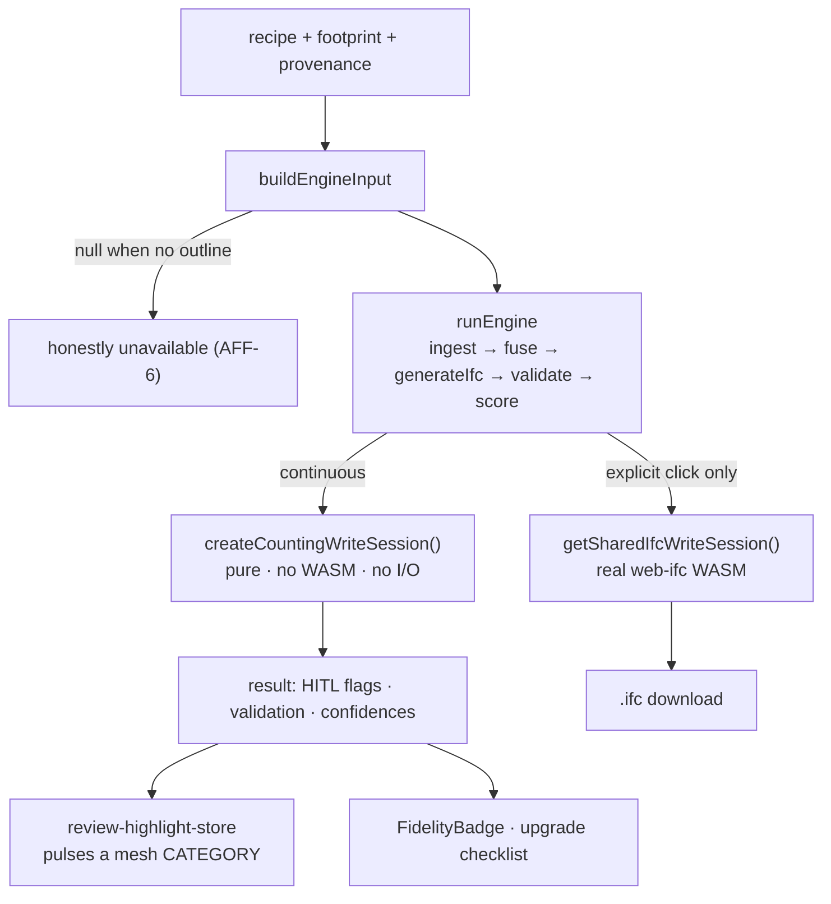

# Twin Fidelity and IFC Engine

## Purpose

Say out loud **how trustworthy this particular twin is**, tell the user which
input to improve next, and let the model leave the app as a real IFC4 file.

## User / System Outcome

A badge in the step-3 속성 dock states a fidelity level and completeness, backed
by an upgrade checklist ("add a CAD footprint", "supply an equipment schedule").
Low-confidence generated elements are flagged for human review and pulse in the
3D scene. An explicit export click produces an IFC file.

## Current Status

**implemented and reachable.** `useEngineResult` is mounted from both
[properties-panel.tsx:143](../../src/components/workspace/properties-panel.tsx)
and [report-stage.tsx:178](../../src/components/report/report-stage.tsx).
16 test files under `src/lib/engine`, 12 under `src/lib/fidelity`.

## Workflow

Step 3 — the badge and checklist live in the 속성 dock. Step 4 — the fidelity
section is composed into the report.

## Architecture

The hard split in [use-engine-result.ts](../../src/hooks/use-engine-result.ts)
is the load-bearing design decision: `result` is recomputed inside an effect with
the **pure counting session** on every recipe/footprint change, so the fidelity
numbers are always current and cost nothing; `exportIfc()` is the **only** call
site touching the real WASM write session, and only on an explicit click. That
is a deliberate cost/latency boundary, not an oversight.

`buildEngineInput` returns `null` for `footprintSource` `parcel` or `null`, or
when no recipe exists — the engine is then honestly unavailable rather than
fabricating a footprint (fitness function AFF-6).

## State Ownership

- `useTwinProvenanceStore` (persist `bim-twin-provenance`, keyed by pk) —
  `hasCadFootprint`, `hasCadPlan`, `hasEquipmentSchedule`, `hasIfcModel`,
  `cadOrigin`, and `equipmentInstallYear` (annotated in-store: *does not drive
  energy; capacity does*).
- `useReviewHighlightStore` — session-only HITL pulses.
- `useBimModelStore` — the IFC session writes from the snapshot, not from a
  separate model.
- IndexedDB `bim-model-{buildingPk}` — an uploaded IFC/glTF/GLB `ArrayBuffer`
  plus filename/type/size/uploadedAt, via `src/lib/model-storage.ts`.

## Implementation

- [orchestrator.ts](../../src/lib/engine/orchestrator.ts) + `steps/{ingest,fuse,generate-ifc,validate,score}.ts`
- [use-engine-result.ts](../../src/hooks/use-engine-result.ts) — the pure/WASM split
- [build-engine-input.ts](../../src/lib/engine/build-engine-input.ts) — the honest-null seam
- [fidelity-assessor.ts](../../src/lib/fidelity/fidelity-assessor.ts) · [input-provenance.ts](../../src/lib/fidelity/input-provenance.ts) · [upgrade-checklist.ts](../../src/lib/fidelity/upgrade-checklist.ts)
- [ifc-session.ts](../../src/lib/ifc/ifc-session.ts) — the shared web-ifc write session
- [twin-provenance-store.ts](../../src/store/twin-provenance-store.ts)

## Relevant Tests

- [orchestrator.test.ts](../../src/lib/engine/__tests__/orchestrator.test.ts) · [counting-session.test.ts](../../src/lib/engine/__tests__/counting-session.test.ts) · [build-engine-input.test.ts](../../src/lib/engine/__tests__/build-engine-input.test.ts) · [engine-download.test.ts](../../src/lib/engine/__tests__/engine-download.test.ts)
- [fidelity-assessor.test.ts](../../src/lib/fidelity/__tests__/fidelity-assessor.test.ts) · [input-provenance.test.ts](../../src/lib/fidelity/__tests__/input-provenance.test.ts) · [building-calibration-loader.test.ts](../../src/lib/fidelity/__tests__/building-calibration-loader.test.ts)
- `src/store/__tests__/` — provenance store versioning

## Failure Modes

- No outline → `available: false`, and the UI states that reason instead of
  showing a number.
- The web-ifc WASM is large; calling `getSharedIfcWriteSession()` anywhere other
  than `exportIfc()` would pull it into the continuous render path. The comment
  at the call site says so explicitly.
- HITL pulses target categories, not expressIds, because generated IFC ids have
  no per-mesh correspondence — a door flag therefore has nothing to pulse.

## Known Limitations

- The engine input is built from the recipe, so it **inherits the single-ring /
  total-height envelope simplification** described in [[Twin Energy Model]].
  Fidelity can only be as honest as the geometry it scores.
- Fidelity labels (Level 1 공공데이터 / Level 2 보강 모델 / Level 3 보정 모델)
  describe input provenance, not calibration against measured consumption,
  except where a `src/data/building-calibrations/` entry exists.
- This scores the **twin**, not the canonical diagnosis. The provenance model in
  [[Traceable Energy Diagnostics]] is a separate, stricter mechanism operating on
  facts rather than on inputs.

## Related Systems

[[Digital Twin Viewer]] · [[CAD Drawing Ingest]] · [[Report and Export]] · [[BIM Document Model]] · [[Traceable Energy Diagnostics]]
