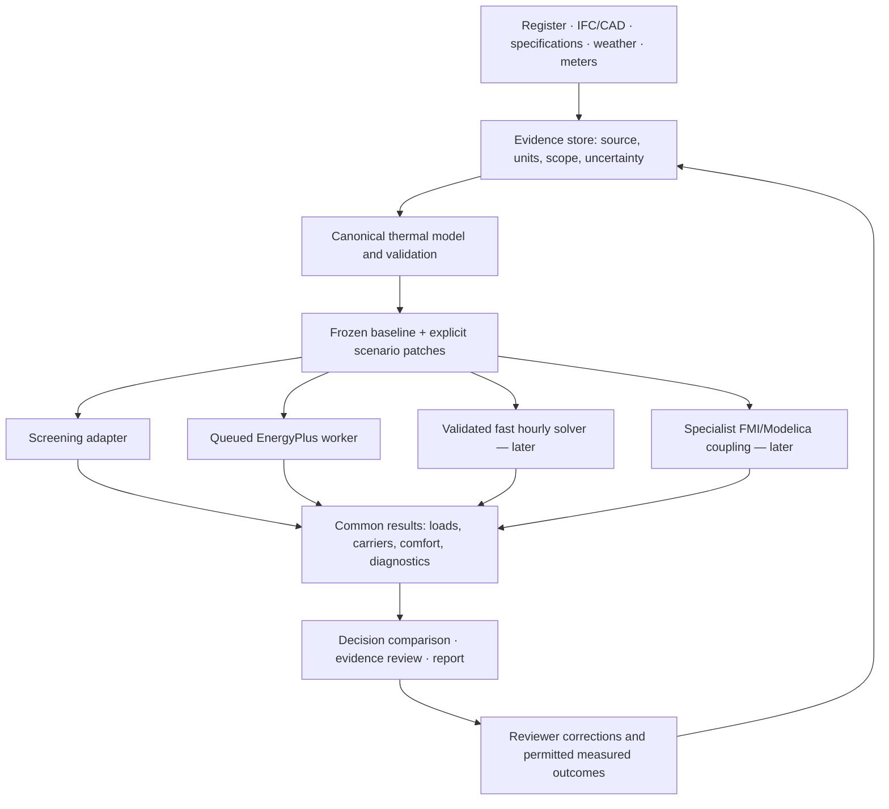

# Energy0: a more accurate, capable and broadly applicable simulation platform

## Recommendation

Build **one evidence-backed thermal model with several validated execution paths**: an immediate screening result, a detailed EnergyPlus simulation, and eventually a fast reduced-order solver for interactive exploration. Add specialist system/control coupling only when a real use case requires it. Keep the same inputs, provenance and result accounting across these paths.

The near-term competitive opportunity is the full process from imperfect building evidence to a reviewable decision. A new numerical solver alone cannot fix an incorrect conditioned area, an invented schedule or a misclassified heat carrier. BIMFIT should first make those errors observable and correctable, then measure whether its complete workflow improves on professional practice.

This report responds to the ambition to exceed current tools in accuracy, power and universality. **No such superiority has been demonstrated.** It establishes the design, comparisons and evidence needed to test that ambition. No hourly solver, EnergyPlus worker, calibrated model or certification capability was implemented by writing this report. Commercial application and priorities are defined in [[Business and Service Model]].

## 1. Scope and research method

Reviewed the actual Energy0 computation and consumption paths, current reference-model pipeline, primary simulator documentation, official standards/catalogues, validation guidance and public benchmark/data projects. Research date: 2026-09-07. Sources are linked beside claims; product choices and targets are identified as recommendations.

This is an engineering/product design review, not a numerical intercomparison study. Commercial vendor pages establish advertised functionality, not independent accuracy. Full paid standards were not obtained; their catalogue scopes do not establish implementation compliance. Source models and existing software tests cannot substitute for empirical validation of physical predictions.

Three separate comparisons are required:

| Question | Fair comparison |
|---|---|
| Is the solver better? | Same geometry, properties, weather, schedules, systems, tolerances and outputs |
| Is the pipeline better? | Same original documents; include ingestion errors, assumptions, correction time and failed cases |
| Is the product better for a professional? | Same decision, deadline and review standard; measure total effort and usefulness of the handover |

## 2. What Energy0 actually does today

The published reference models and twin use `calculateAnnualDemand` through their existing hooks/exporter. The canonical diagnostics path has stronger fact provenance but still uses the shared simplified energy modules. It is not an independent detailed physics oracle. See [annual-demand.ts](../../src/lib/energy/annual-demand.ts), [use-energy-metrics.ts](../../src/hooks/use-energy-metrics.ts), [energy-dataset.ts](../../src/lib/reference-buildings/energy-dataset.ts) and [System Architecture](../01_Architecture/System%20Architecture.md).

### Current method

With air-coupled heat-loss coefficient H in W/K, the heating term is `H × HDD × 24 / 1000`, plus a ground term annualised at its own temperature difference for **4,380 assumed hours**. The total is divided by heating efficiency/COP. Cooling combines the CDD term and window area × SHGC × seasonal irradiation × **0.7 assumed shading/frame factor**, divided by cooling COP. These are annual delivered heating/cooling estimates, despite variables named `heatingDemand` and `coolingDemand`.

| Verified code behaviour | Consequence | Priority |
|---|---|---|
| Whole-building degree-day calculation | Does not resolve hourly thermal storage, schedules, zone temperatures or peaks | Add hourly path; retain explicitly scoped screening |
| Heating has no explicit solar/internal-gain utilisation; cooling has no explicit internal/latent load balance | Limits glass-heavy, high-occupancy and hot-humid comparisons | Resolve gains and sensible/latent balances in the hourly path |
| No cooling system gives zero cooling electricity | Does not establish zero cooling load or comfortable rooms | Separate loads, consumption and unmet comfort |
| Heating efficiency bounded to 0.3–6; percentages inferred from magnitude | Numerical guard can hide unsupported input semantics | Typed efficiency/COP with explicit interpretation and validation |
| Annual demand's fuel record distinguishes electric and district heat, but `deliveredFromDemand` assigns all heating to gas | Grade/report primary-energy split can disagree with the physical heat carrier | **P0: one carrier/end-use ledger** |
| Delivered split adds 15% of HVAC for electricity and 10% for DHW | Ratio assumptions are not measured lighting, plugs or hot water | Expose them; replace with explicit schedules/loads where known |
| Oil is proxied with gas in the annual fuel record | Not a fuel-specific emissions model | Separate carrier and region/year factors |
| Weather processor aggregates daily means into HDD18/CDD24 | Weather ingestion does not provide an hourly forcing model | Hourly meteorology with quality checks |
| `calibrateEnergy` splits gas 80/20 and electricity 40/60 before comparing annual values | Its “actual” end uses are inferred, and its ratio is not parameter estimation | Rename scope in presentation; build proper calibration separately |
| Twin and canonical input paths remain separate | Different traceability guarantees reach different surfaces | Unify inputs before growing competing engines |

Code evidence: [delivered-from-demand.ts](../../src/lib/energy/delivered-from-demand.ts), [weather-processor.ts](../../src/lib/energy/weather-processor.ts), [calibration.ts](../../src/lib/energy/calibration.ts). The weather file's leading 18.3°C comment conflicts with its actual constant of 18.0°C; runtime code governs this report. These findings require focused implementation and regression checks, not silent replacement of published dataset baselines.

### Input accuracy is already a limiting factor

The reference pipeline has encountered omitted envelope areas, net/gross confusion, stacked roof surfaces, source-specific winding, incomplete apertures, synthetic examples and absent operating data. Correct source geometry is valuable, but a 3D coordination file does not establish occupancy, airtightness or seasonal system performance. Extra mesh detail and photorealistic textures do not improve a thermal calculation unless they establish relevant physical inputs.

Existing tests establish important software invariants. They do not establish prediction error against occupied buildings. Published reference datasets explicitly distinguish calculated energy from metered consumption; that distinction must survive every new mode and export.

## 3. Define the ambition in measurable terms

**Accuracy:** conserve energy and mass; reproduce analytical solutions; pass relevant comparative/empirical tests; predict withheld metered energy and indoor conditions with reported error and uncertainty. Evaluate input preparation separately from solver error.

**Power:** represent hourly/subhourly loads, sensible/latent behaviour, thermal mass, HVAC capacity and controls, renewables/storage, comfort constraints and interacting retrofit packages. Scale scenario studies without losing reproducibility or hiding failed runs.

**Universality:** use a documented extensible model across climates, building uses, geometries, system types and jurisdictions. Publish a support matrix and decline unsupported combinations. “Universal” should mean explicit extensibility and broad tested coverage, not a promise that arbitrary BIM becomes a correct simulation automatically.

Success on annual energy alone is insufficient. A model can match an annual bill with the wrong heating/cooling balance, fail peak sizing, or predict savings from the wrong mechanism.

## 4. Existing tools and what to build around

| Engine or tool | Established role | Recommended role for BIMFIT |
|---|---|---|
| EnergyPlus | Detailed whole-building simulation with coupled zone/system calculations | First detailed execution backend and differential comparison engine |
| OpenStudio SDK | Building-model authoring/translation and workflows around EnergyPlus/Radiance | Optional translator/workflow layer; not a second independent physics reference |
| Modelica Buildings / Spawn | Dynamic component/system models and coupling to building heat transfer | Later advanced HVAC, controls and district studies |
| IDA ICE | Commercial dynamic multi-zone simulation, BIM/version workflows, configurable systems | Serious comparator; do not assume BIMFIT's proposed workflow is unique |
| TRNSYS | Transient simulation kernel and component library | Specialist comparator for integrated energy systems |
| CONTAM | Multizone airflow and contaminant transport | Targeted airflow/IAQ studies when required |
| THERM | Two-dimensional heat-transfer analysis of envelope details | Thermal-bridge preprocessing for selected junctions |
| Existing Energy0 | Fast annual screening calculation with growing provenance and geometry support | Immediate estimate within its declared limits |

EnergyPlus models zone/system interactions, transient envelope behaviour and environmental effects; its documentation describes these capabilities. **26.1.0, released 2026-03-31, is the stable release verified for this report.** The later 26.2 IOFreeze entry is a prerelease, not the recommended production pin. [EnergyPlus Essentials](https://energyplus.readthedocs.io/en/latest/essentials/essentials.html), [26.1.0 release](https://github.com/NatLabRockies/EnergyPlus/releases/tag/v26.1.0).

OpenStudio supports EnergyPlus and Radiance workflows. Modelica Buildings provides dynamic building/system components; its published versions and Spawn integrations have their own compatibility constraints. Pin and test the whole adapter/runtime combination, rather than combining the newest versions by name. [OpenStudio repository](https://github.com/NatLabRockies/OpenStudio), [Modelica Buildings](https://simulationresearch.lbl.gov/modelica/), [Spawn documentation](https://lbl-srg.github.io/soep/).

IDA ICE already advertises iterative BIM-based modelling, detailed dynamics and cloud optimisation. TRNSYS exposes a transient kernel and extensible components. Their existence argues for a strong interoperability and validation strategy rather than an unsupported “first” or “best” claim. [IDA ICE](https://www.equa.se/en/ida-ice), [TRNSYS](https://www.trnsys.com/).

CONTAM handles pressure-driven multizone airflow and contaminants. THERM addresses two-dimensional conduction/radiation in details; its download page explicitly warns against using the 8.1 beta for conventional applications. Neither should be treated as a full replacement for the building energy engine. [NIST CONTAM](https://www.nist.gov/services-resources/software/contam), [LBNL THERM](https://windows.lbl.gov/therm-software-downloads).

### Build-versus-integrate decision

**Integrate the detailed backend first.** Own the canonical evidence model, input validation, BIM-to-thermal conversion, scenario semantics, comparison interface and reproducible result contract. Those are central to BIMFIT's mission and current failure modes. Reimplementing decades of HVAC components before establishing these boundaries would postpone useful validation.

Build a native reduced-order solver only after selecting a bounded use case, such as fast envelope/operating-schedule comparison. It must earn its role through benchmark accuracy and materially lower latency. A faster but unbounded approximation cannot silently replace the detailed engine.

## 5. Proposed architecture

This is a proposed architecture, not the current deployment. Write an implementation ADR before introducing worker infrastructure or replacing the shared result path.

### Canonical model contract

| Entity | Essential fields |
|---|---|
| Building/site | Stable identity, coordinates, elevation, true north, time zone, use, floor-area definitions |
| Thermal zone | Air volume, conditioned area, boundary references, thermostat/operating regime, humidity model |
| Surface/opening | SI geometry, orientation, area scope, construction, adjacency, exposure, shading, ground boundary |
| Construction/material | Ordered layers, thickness, conductivity, density, heat capacity; optical and moisture properties where applicable |
| System/network | Served zones, carrier, capacities, curves, loops, ports, controls, availability and setpoints |
| Loads/schedules | Occupancy, sensible/latent gains, lighting, equipment, DHW, ventilation and infiltration semantics |
| Weather/meters | Period, interval convention, quality flags, units, location, licence and file hash |
| Fact/evidence | Source reference or explicit assumption/user input, method, date, scope, uncertainty, reviewer state |
| Scenario/run | Baseline hash, immutable changes, engine/adapter/schema versions, warnings, status, output hashes |

Keep missing, documented zero, unsupported, inferred and measured as different states. Use explicit units at ingestion and SI internally. Reject conflicting units or unsupported efficiency meanings instead of guessing from magnitude. Preserve source identifiers through the render and thermal representations, without requiring identical meshes.

The common result contract also needs capability flags and explicit unavailable/null values. Screening must not supply invented hourly temperatures, loads, peaks or comfort merely because a detailed backend can populate those fields. Retain the existing adapter's distinction between supported results and absent outputs.

Deterministic IDs should derive from source identity plus transformation context, not human-readable slugs alone. Source-specific corrections must cite the source and remain distinguishable from generic parser rules.

## 6. BIM-to-BEM conversion is a core engineering product

The thermal model is a zone/boundary graph. It should use watertight, simplified heat-transfer surfaces, not triangulated visual detail as a substitute for adjacency.

Recommended conversion sequence:

1. Resolve schema, units, nested placements, map conversion and true north. Record non-uniform scales and invalid transformations.
2. Establish occupied/conditioned scope from evidence; identify shafts, voids, roof spaces and external areas. Compare independently derived floor/volume totals.
3. Read space boundaries where present. Resolve corresponding sides and openings; derive missing boundaries only with an explicit geometric method and diagnostics.
4. Reconcile host walls, window/door holes, coplanar duplicates and thermal construction ownership. Keep gross and net areas separately.
5. Classify outdoor, adjacent-zone, adiabatic, ground and unconditioned-space boundaries. Absence of a relation is unknown, not proof of an exterior surface.
6. Validate shell closure, adjacency symmetry, normal orientation, positive volumes, sensible tolerances and area/UA conservation.
7. Preserve traceable links back to each source element and show unresolved problems in the existing upload/twin workflow.

IFC second-level boundaries explicitly represent corresponding boundaries. The specification also states that a parent boundary is not cut by its inner boundaries: the representations overlap. Therefore subtract openings exactly once when producing a net opaque thermal surface. [buildingSMART IfcRelSpaceBoundary2ndLevel](https://standards.buildingsmart.org/IFC/RELEASE/IFC4_3/HTML/lexical/IfcRelSpaceBoundary2ndLevel.htm).

Keep automatic repair reversible. A tolerance that closes a tiny numerical crack must not erase a real doorway, thin layer or courtyard. A source-specific roof-winding exception needs a reproducible fixture and an explanation, not a global rule to accept every downward face.

For source MEP, graph connectivity and system labels are evidence; nearest-root colouring is not proof of supply/return direction. A port marked bidirectional cannot become a measured airflow. Missing equipment/control data must remain visible even when a plausible schematic is drawn.

## 7. Physics roadmap

### Thermal envelope and zone balance

For a simple zone node, a useful analytical starting point is:

`C dT/dt = Σ H_j(T_j − T) + Q_solar + Q_internal + Q_HVAC`.

This is a model equation, not a complete universal building solver. A multi-node resistance/capacitance network can represent heat storage more accurately than degree days. Establish the required node structure and integration stability experimentally, then compare with detailed conduction cases. Surface convection, longwave exchange, solar distribution, ground coupling and bridges must follow documented methods rather than tuned constants chosen to match one annual total.

ISO 52016-1:2017 covers sensible/latent needs, internal temperatures and loads with hourly and monthly procedures in its stated scope. It replaces ISO 13790. The official catalogue is a method reference; using an RC model or mentioning the standard does not establish conformity. [ISO 52016-1 catalogue](https://www.iso.org/standard/65696.html).

### Solar, glass, ground and thermal bridges

Resolve solar position in site time, direct/diffuse radiation, surface incidence, shading and glazing/frame scope. Use measured or specified glazing properties where available; visual transparency and a material name are insufficient to establish SHGC or whole-window U-value.

Treat slabs/basements with geometry-aware ground coupling and an appropriate periodic/soil boundary. Separate a stated whole-assembly U-value from one recomputed using assumed surface films. Thermal bridges require junction geometry or explicitly sourced linear/point transmittance; merely rendering a mullion does not establish its heat loss.

### Air, moisture and comfort

Separate natural infiltration, mechanical ventilation, pressure-test ACH50 and schedules. Preserve the current explicit ACH50-to-natural assumption where screening needs it, but do not present the conversion as measured operation. Detailed modes should account for wind/stack effects at an appropriate fidelity and distinguish sensible from latent recovery.

Hot-humid climates and latent-dominated systems require moisture balances, psychrometrics, dehumidification and latent equipment behaviour. Natural ventilation and absent cooling require free-running temperatures and unmet comfort reporting. CFD is a specialist tool for local questions, not a prerequisite for every annual run.

### HVAC and controls

Model zone loads before system consumption. Add capacities, availability, setpoints, part-load performance, distribution losses, fan/pump power, heat recovery, economisers, defrost where relevant and control sequencing. Distinguish nameplate/rated COP from seasonal performance and equipment absence from missing data.

Start with a tested set: ideal loads for fabric validation, gas boiler/radiators, air-source heat pump, district heat, packaged cooling, and a defined ventilation system. Publish valid combinations and omissions. Do not market complex hospital HVAC, radiant systems, thermal networks or process loads until their components and couplings are verified.

### Electricity, DHW, PV and storage

Use one end-use/carrier ledger across energy, cost, emissions and reports. Maintain separate useful load, delivered energy, gross site consumption, onsite generation, grid import/export and primary energy. Apply emission and tariff factors with jurisdiction, year and scope. Demand charges and time-varying prices require interval data; annual kWh cannot reconstruct them.

Existing PV and proposed additions are separate assets. Installed capacity contributes to the baseline; investment and incremental benefit apply only to new work. Compute each array's orientation, weather, shading, inverter and loss assumptions separately when data permits. An aggregate representative tilt must remain labelled as such.

PVWatts v8 documents hourly AC/DC output in **watts** and monthly/annual energy in **kWh**. Integrate interval power with its timestep and distinguish these units. Its API is a possible comparator/adapter, subject to weather coverage and assumptions; it does not establish the feasibility of a roof installation. [PVWatts v8 API](https://developer.nlr.gov/docs/solar/pvwatts/v8/).

Storage adds state of charge, charge/discharge efficiency, power/energy limits and dispatch controls. A retrofit package must be simulated as a package: independent percentage savings cannot simply be added.

## 8. Weather, operational data and calibration

### Weather quality

Use an hourly weather contract with dry-bulb temperature, moisture, pressure, wind, direct/diffuse radiation and required sky/ground fields. Validate timestamps, timezone, hour-ending conventions, leap years, missing codes, duplicate intervals, impossible values and radiation consistency. Track imputation and rejected intervals. Never silently stretch a partial year into a measured annual total.

Typical-year weather supports representative design comparisons; actual meteorological year data supports comparison with bills from that year. Nearest station alone does not establish suitability where elevation, terrain or urban exposure differs. EnergyPlus guidance discusses typical versus actual weather and site selection. [EnergyPlus weather guidance](https://energyplus.readthedocs.io/en/latest/essentials/essentials.html#weather).

### Calibration as parameter inference

Start by reconciling meter identity, carrier units, billing periods, occupancy changes, onsite generation and export. A meter's electrical total does not disclose cooling versus plug loads. Use bounded priors for uncertain schedules, infiltration and system properties; retain parameter identifiability diagnostics. Multiple plausible models may fit one bill.

Use independent calibration and holdout periods. When comparing a data-driven model across buildings, split by building/site, not random rows from the same meter. Do not calibrate to the test period or tune physics until it agrees with a specific annual sum. Report before/after error, parameter changes, retained uncertainty and out-of-domain conditions.

FEMP's final 2024 M&V Guidelines v5.0, Table 4-2 (printed page 34; PDF page 45), gives calibrated-simulation reference limits of monthly MBE within ±5% and CV(RMSE) at most 15%, and hourly MBE within ±10% and CV(RMSE) at most 30%. These are calibration criteria, not a promise of future or retrofit prediction accuracy. [FEMP M&V Guidelines v5.0](https://www.energy.gov/sites/default/files/2024-10/mv_guide_5_0.pdf).

For reproducible evaluation, define the metric convention explicitly. With simulated `S_i`, measured `M_i`, `n` valid matched intervals and measured mean `M̄`:

- `NMBE = 100 × Σ(S_i − M_i) / Σ M_i` (positive means overprediction).
- `CVRMSE = 100 × sqrt(Σ(S_i − M_i)² / n) / M̄`.

These use `n`, matching the simple form in the cited FEMP guidance. If a separate protocol uses degrees-of-freedom correction `n − p`, record that convention and do not mix the results. Report absolute errors when mean energy is near zero; do not display an undefined normalised metric as zero.

### Uncertainty and the next best measurement

Separate uncertainty in inputs, model form, measurements and future operation. Begin with transparent sensitivity and bounded scenarios. Later use calibrated distributions and Monte Carlo or other justified methods, preserving correlations and scenario constraints. Report a probability interval only when its construction and calibration are defensible.

Prioritise information that could change the decision: e.g. verify HVAC fuel before comparing electrification, or roof obstructions before pricing a PV array. An advanced value-of-information module can estimate expected reduction in decision loss minus measurement cost. Until probabilities and decision costs are credible, provide an explicit sensitivity-based verification list instead of false precision.

## 9. Validation programme and data strategy

| Layer | Test material | What it establishes |
|---|---|---|
| Units and accounting | Dimensional checks, energy/carrier sums, interval integration | Internal correctness and consistent semantics |
| Analytical physics | Steady wall, RC step response, mixing box, ideal-load balance | Agreement with a known solution under defined assumptions |
| Geometry conversion | Synthetic cases plus independently checked IFC fixtures | Areas, adjacency, placements and boundary scope |
| Comparative simulation | Relevant ASHRAE 140 cases; matched EnergyPlus cases | Behaviour against established test comparisons |
| Empirical validation | Controlled experiments and measured occupied buildings | Prediction performance against observations |
| Controls | Selected BOPTEST emulators and published KPI procedures | Fair controller comparison within the emulator |
| Product workflow | Matched professional projects and independent report review | Time, failure modes and decision usefulness |

ASHRAE's Standard 140 resources include accompanying test material and reference results. Its methods span different validation purposes; passing selected cases is not certification of every building/system combination. Track the exact edition, accepted addenda, case inputs and reference results. Draft addenda are not adopted requirements. [ASHRAE 140 resources](https://data.ashrae.org/standard140/), [accompanying files](https://data.ashrae.org/standard140/accompany.html), [reference results](https://data.ashrae.org/standard140/reference.html).

BOPTEST provides building emulators and a control benchmarking interface. Its results can compare controllers consistently, but emulator agreement is not empirical proof of a real building's physics. [IBPSA BOPTEST](https://github.com/ibpsa/project1-boptest).

### Use the right dataset for the claim

| Data source | Useful for | Does not establish |
|---|---|---|
| BIMFIT public IFC/reference corpus | Import fixtures, evidence extraction, model/energy reproducibility, known geometry failures | Real operational energy or calibrated performance |
| Building Data Genome 2 | Meter-data QA and held-out prediction studies | Complete matched BIM/plant parameters for every meter |
| NLR end-use load profiles | Stock-level scenario coverage and representative simulated load shapes | Independent measured ground truth for each synthetic building |
| Controlled benchmark experiments | Thermal/component validation under known conditions | Every occupied-building operating regime |
| Permitted client BIM + bills + surveys | End-to-end calibration and decision studies | Broad generalisation without a representative held-out cohort |

Building Data Genome 2 contains hourly meter data for 2016–2017, with 3,053 meters from 1,636 buildings. Preserve raw/cleaned distinctions, units and data permissions. [BDG2 repository](https://github.com/buds-lab/building-data-genome-project-2).

NLR's end-use load profiles arise from building-stock models calibrated with multiple sources, including utility and end-use measurements. They are valuable synthetic outputs, not interchangeable with the measurements used to inform them. [NLR end-use load profiles](https://www.nlr.gov/buildings/end-use-load-profiles).

### Proposed release gates — targets, not measured results

1. Every required input is sourced, supplied by a user or explicitly assumed; no critical unresolved contradiction is silently repaired.
2. Analytical cases meet declared numerical tolerances and show expected convergence; energy/mass residual tolerances are defined per solver and scale.
3. Relevant Standard 140 cases satisfy the selected protocol's evaluation, with every excluded or failing case published internally and scoped out of claims.
4. A proposed fast solver agrees with the pinned detailed solver within **5% annual HVAC energy and 10% peak load** on its declared test domain; use absolute limits for near-zero denominators. These are initial product targets, not standard requirements.
5. Calibration and holdout error are both reported by carrier, season and building type. FEMP calibration limits alone do not satisfy the holdout gate.
6. An external reviewer can reconstruct the principal scenario result and its assumptions from the exported package.
7. Any superiority claim names the comparator, dataset, input preparation, metric, distribution of errors, failures and statistical uncertainty. Do not average away a climate/system class that regresses.

For a claim such as “more accurate,” pre-register the primary metric and test set before tuning. Compare on matched cases with paired uncertainty estimates, report median and tail error, and include failed/unsupported runs in coverage reporting. A small convenience sample can guide development but cannot justify “universally better.”

## 10. Execution platform, performance and interoperability

Keep Next.js as the interactive/control layer. Run detailed simulations in isolated, queued workers with pinned container/runtime images, durable object storage and explicit job states. Do not put a long annual simulation inside an ordinary request handler. Preserve the existing Seoul-region upstream data access where required.

Each run should record `modelHash`, `scenarioHash`, weather hash, engine version, adapter version, schema version, timestep, numerical options, executable/container digest, warnings and result hashes. Hash all physically relevant settings for cache keys. Retry infrastructure failures separately from model errors; cancellation and queue limits should be visible.

Validate files before execution, bound resource use and isolate native parsers/simulators. Private customer files need authenticated authorisation, tenant boundaries, retention/deletion and backup recovery. These are proposed requirements; the current browser-local product does not yet provide an enterprise simulation service.

EnergyPlus exposes APIs that can support instrumented execution; pinned file-based runs are a simpler first worker contract. Avoid assuming a frontend API call can safely manage a native simulation process. [EnergyPlus API documentation](https://energyplus.readthedocs.io/en/latest/api.html).

FMI defines interfaces for model exchange and co-simulation. It is a later interoperability option, not a guarantee that arbitrary FMUs share compatible timesteps, units or solver assumptions. Record supported FMI version and test each coupling. [FMI standard](https://fmi-standard.org/).

The EnergyPlus licence allows redistribution/modification subject to its conditions and includes specific name/version provisions; review the actual pinned licence and notices when packaging it. Do not reduce that review to a generic “BSD” label. OpenStudio also has its own distribution terms. [EnergyPlus 26.1.0 licence](https://raw.githubusercontent.com/NatLabRockies/EnergyPlus/v26.1.0/LICENSE.txt), [OpenStudio licence](https://raw.githubusercontent.com/NatLabRockies/OpenStudio/develop/LICENSE.md).

Optimisation should search feasible packages under budget, comfort and engineering constraints, retaining a Pareto set rather than a single unexplained score. Parallelise independent runs and cache unchanged baselines. Surrogates can accelerate repeated searches only within a documented validation domain, with an explicit fallback to the detailed solver.

## 11. Korean applicability and international expansion

Separate physical simulation from policy assessment. Korean primary-energy factors, grade thresholds, approved methods and certification procedures belong in dated jurisdiction modules. A detailed EnergyPlus result does not automatically constitute an ECO2 or official ZEB certification result.

The official Korean portal lists **ECO2_2025V1_1014** on its September 2025 download page. Current ZEB operating regulations reviewed include an effective date of **2026-03-20**. Use those official materials when designing interoperability and re-check the governing edition before implementing an assessment. Older repository labels or archived ECO2 files must not determine current certification claims. [Official ECO2 download notice](https://zeb.energy.or.kr/BC/BC04/BC04_02_001_view.do?no=101), [ZEB operating regulations](https://www.law.go.kr/schlPubRulInfoP.do?schlPubRulSeq=2200000155049).

The source IFC examples outside Korea currently use disclosed climate/system assumptions in places. They can exercise import variety without proving localised predictions for the original site. International expansion needs actual site weather, local schedules and equipment, carrier factors, tariffs, language and standards—not just another flag in the interface.

Recommended coverage matrix: cold/mixed/hot-humid/hot-dry climates; residential/office/education/retail/healthcare; lightweight/heavy/high-glazing construction; natural/mechanical ventilation; gas/electric/district systems; simple/complex geometry; low/high evidence completeness. Expand cells only when representative cases pass.

## 12. Delivery plan with stopping rules

These are ordered work packages, not promised dates. Staffing and access to measured buildings determine duration. A credible team needs building-physics/HVAC expertise, software/data engineering and independent QA; an AI agent does not remove the need for professional review.

| Phase | Deliverable | Exit evidence / stopping rule |
|---|---|---|
| 0 — trustworthy current results | Shared end-use/carrier accounting; explicit unsupported benefits; frozen baseline versions; traceable path integration plan | Scene, comparison, grade and export reconcile on targeted fixtures |
| 1 — canonical thermal compiler | Zone/boundary schema, evidence graph, import validation and one simple model translator | Analytical geometry/area/adjacency cases and independently checked IFC case |
| 2 — detailed execution | Pinned EnergyPlus worker, hourly weather, ideal loads then supported HVAC, common result contract | Reproducible annual run, useful warnings, cancellation, matched baseline/scenario comparison |
| 3 — credible professional pilot | Reviewed decision package with explicit uncertainty and export | Independent reconstruction and paid-project evidence as defined in the business plan |
| 4 — empirical programme | Meter QA, bounded parameter calibration, held-out evaluation | Error report by carrier/season/site; no calibration/test leakage |
| 5 — fast exploration | Bounded hourly reduced-order solver and package optimisation | Accuracy gates plus measured latency advantage; reject if neither is material |
| 6 — broader domains | More systems/climates, FMI coupling, specialist tools | New coverage cells pass before new capability claims |

Immediate experiments:

- **Carrier reconciliation:** gas, heat pump and district heat fixtures must preserve useful load while moving delivered energy, cost and emissions through the correct carrier. Existing PV must survive a proposed addition without charging for installed assets.
- **One-zone reference:** reproduce steady state and an RC step response, then run the equivalent ideal-load EnergyPlus model. Diagnose input or method differences before tuning.
- **One real source conversion:** independently total areas, openings and adjacencies; compare the translated thermal model to source evidence. Reject a seemingly successful run that changed the conditioned scope.
- **One decision package:** compare baseline plus a small feasible package set with a professional reviewer. Record which missing input most affects the recommendation and total preparation/review time.
- **One permitted measured case:** fit on one period, evaluate another, and report the failure modes. Do not generalise a single success to the entire library.

## 13. What remains uncertain

No measured comparative accuracy, solver runtime benchmark, paid-customer response or validated comfort result was produced in this research. Full normative procedures and commercial tools require further access for implementation/testing. EnergyPlus/OpenStudio/Spawn compatibility must be established for the exact versions selected. Client-data availability and reviewer capacity remain commercial dependencies.

The recommended path is testable: own the evidence and problem structure, use mature physics where it helps, and earn broader claims through reproducible evaluation. Product development should reward a better-supported decision, including a justified decision to measure more before investing.
